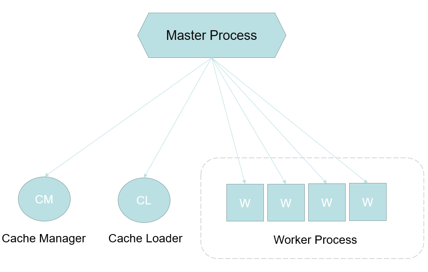
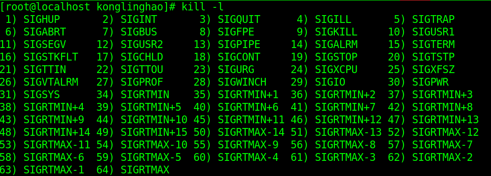
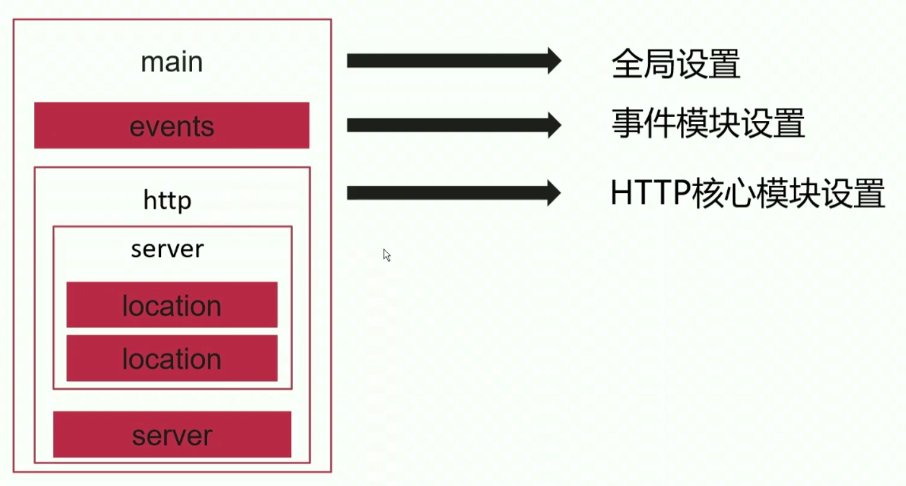

# 2、Nginx进程结构与热部署

## 2-1 Nginx 的进程结构

- nginx 采用的是多进程的一种进程结构，这是为了**高可用性和高可靠性**。



### Master Process

- Master Process 并不真正地处理用户的请求，真正处理请求的是下方的 Worker Process，Master Process 进程只是监控它下面的子进程，看看它们有没有挂掉啥的，如果挂掉了，它会新开一个子进程来维持当前的结构。还有一种情况就是配置文件修改了之后，Master Process 也会去通知它的子进程（其实就是热部署）。
- 我们知道 nginx 是基于模块化的，自己设计模块的时候尽量少动 Master Process，因为如果 Master Process 挂了的话就会影响到很多东西。

### Worker Process

- 是真正处理请求的子进程。
- Worker Process 在实际的生产环境中也不一定是 4 个。

### CM 和 CL

- CM 和 CL 也是两个子进程，一看就是管理缓存的两个子进程。
- nginx 有一个最主要的应用场景：**反向代理**。也就是说，它会把动态请求代理给后端应用程序服务器，应用程序接受到请求了然后处理计算之后，把内容动态地返回给 nginx 的过程中，可以进行缓存；真正提供缓存功能的不是 CM 和 CL，是 Worker Process（也就是说决定缓存哪些内容），Cache Loader 用来加载缓存，Cache Manager 用来管理缓存

**所有的子进程之间的通信都是通过共享内存的方式来进行通信的。**

## 2-2 Linux 的信号量管理机制

- 在 Linux 中，是通过信号量来进行进程管理的。比如我们经常使用的 **kill** 命令，这个命令可以发送很多的信号量。Linux 中的信号量如下所示：



- 我们日常中使用 **kill $PID** 去杀死一个进程，实际上就是发送了 **SIGTERM** 这个信号给 Linux ，Linux 收到了这个信号之后就知道要关闭这个进程。
- 常用的信号量：

| 信号量   | 命令格式      | 作用                                                         |
| -------- | ------------- | ------------------------------------------------------------ |
| SIGCHLD  | kill -17 $PID | 在一个进程终止或者停止时，将 SIGCHLD 信号发送给其父进程，按系统默认将忽略此信号，如果[父进程](https://baike.baidu.com/item/父进程/614062)希望被告知其子系统的这种状态，则应捕捉此信号。 |
| SIGQUIT  | kill -3 $PID  | 程序终止信号，在用户键入 QUIT 字符时发出，用于通知前台进程组终止进程。进程在因收到 SIGQUIT 退出时会产生 core 文件, 在这个意义上类似于一个程序错误信号。 |
| SIGTERM  | kill -15 $PID | 程序结束(terminate)信号, 与 SIGKILL 不同的是该信号可以被阻塞和处理。通常用来要求程序自己正常退出，shell命令kill缺省产生这个信号。如果进程终止不了，我们才会尝试 SIGKILL。 |
| SIGKILL  | kill -9 $PID  | SIGKILL是发送给一个[进程](https://baike.baidu.com/item/进程/382503)来导致它立即终止的信号 |
| SIGHUP   | kill -1 $PID  | 它会迫使进程重新读取配置文件                                 |
| SIGUSR1  | kill -10 $PID | Linux 提供的自定义的信号量                                   |
| SIGUSR2  | kill -12 $PID | Linux 提供的自定义的信号量                                   |
| SIGWINCH | kill -28 $PID | Linux 提供的自定义的信号量                                   |

## 2-3 利用信号量管理 Nginx

### 使用信号量来管理 master 和 worker

- 可以直接给 Master 进程发送信号量，来让它进行管理。
  - 命令形式：**kill -s 信号量 进程号**
- 可以给 Worker 进程发送信号量，但是本身并不推荐直接给它发信号量来对它进行管理，因为它的管理是由 Master 来的，通常的做法是给 Master 进程发送信号量，然后让 Master 进程去管理 Worker 进程。
  - 命令形式：**kill -s 信号量 进程号**
- 可以直接通过 nginx 的二进制程序（ /opt/nginx/sbin/nginx ）加些参数来对 master 发送信号量。
  - 命令形式：**/opt/nginx/sbin/nginx -s 参数**

**Master 进程接收的信号量：**

- 监控 worker 进程就收信号
  - CHLD（子进程挂掉会发这个信号量给 Master 进程）
- 管理 worker 进程接收信号
  - TERM，INT
  - QUIT
  - HUP
  - USR1
  - USR2
  - WINCH

**worker 进程接收的信号量（通常不建议发送这样的信号量）：**

- TERM，INT
- QUIT
- USR1
- WINCH

**命令行（ nginx 的二进制程序（ /opt/nginx/sbin/nginx ）加些参数，参数如下。执行这些命令本质上就是给 master 进程发送信号量）**

- reload：HUP
- reopen：USR1
- stop：TERM
- quit：QUIT

### 信号量管理例子

- **kill -s SIGTERM 26734**：杀死 Master 进程（Master 进程 PID 为 26734）
- **kill -s SIGHUP 26734**：让 Master 进程重新读配置文件，会重启 worker 进程

用命令行管理（给 master 直接发送信号量的效果一样）

- **/opt/nginx/sbin/nginx -s stop**：让主进程退出

## 2-4 配置文件重载的原理真相

给 Master Process 发送 HUP 信号（或者二进制文件加 reload）能使配置文件重载，这能给 nginx 进行**平滑升级**，也就是说能够不停机生效新的配置。那么它的背后到底发生了一个什么事情呢？

### reload 重载配置文件的流程

1. 向 master 进程发送 HUP 信号（reload 命令）
2. master 进程检查配置文件中的语法是否正确
3. master 进程打开监听端口
4. master 进程使用新的配置文件启动新的 worker 子进程
5. master 进程向老的 worker 子进程发送 QUIT 信号
6. 旧的 worker 进程关闭监听句柄，处理完当前连接后关闭进程

## 2-5 Nginx 的热部署

我们知道 nginx 通常运行于我们整个业务系统的边缘，它通常是最先接收远端的请求的。那对于这样一个应用来说，如何对它进行热升级是非常重要的。

### 热升级的流程

1. 将旧的 nginx 文件替换成新的 nginx 文件（这里指的 nginx 文件是主程序文件，是 sbin 目录下的；要注意的是，如果你的目录结构发生改变的话，这么做是不太行的，还要配上别的操作）。
2. 向旧的 master 进程发送 USR2 信号
3. 旧的 master 进程修改 pid 文件，并在其后面加上后缀 .oldbin（nginx.pid.oldbin 里面存的就是旧的 master 的进程号）。这一步的原因是，替换了 nginx 文件后，配置也发生了改变，旧的进程要给新的进程让路，新的 master 进程也需要 nginx.pid 文件。
4. 旧的 master 进程用新 nginx 文件，启动新 master 进程（这个时候新旧 master 是并存的，我们可以看看新的 master 进程是不是满足我们的预期，如果满足就可以把旧的 master 慢慢退出了）。
5. 向旧的 master 进程发出 WINCH 信号，旧的 worker 子进程退出。WINCH 信号和直接发送 QUIT 信号有什么区别呢？旧的 master 进程有一些旧的 worker 子进程，如果发送 QUIT 信号，旧的 master 和 worker 进程就会一起退出了；如果发送 WINCH 信号，它会使 worker 子进程先退出以避免接收新的请求（旧的请求没处理完的它还是会自己先处理完的），使得新的请求都被路由到新的 worker 子进程。之所以不退出旧的 master 进程，就是为了给回滚情形做准备。
6. 回滚情形：向旧 master 发送 HUP（这个时候会把旧的 worker 子进程拉起来），向新的 master 发送 QUIT。

### Nginx 热部署步骤演示

```shell
# 可以看看自己的 nginx 是不是开着
ps -ef | grep nginx

# 如果直接替换 sbin 下的文件，得确保 /opt/nginx 的目录结构一致 

# 首先我们得备份一下我们的 nginx
cd /opt/nginx/sbin
cp nginx nginx.bak
# 然后如果你有编译好的 nginx 二进制文件，就可以直接复制到这里把旧的 nginx 文件覆盖了（假设这里已经覆盖替换完了）。

# 给旧的 master 进程发送 USR2 信号，主要目的就是启动新的 master
kill -s SIGUSR2 27387 # 旧 master 进程的 PID 是27387
# 这个时候 ps -ef | grep nginx ，可以发现新旧 master 是并存的

# 给旧的 master 进程发送 WINCH 信号，让其退出旧的 worker 子进程
kill -s SIGWINCH 27387
# 这个时候 ps -ef | grep nginx ，可以发现旧 master 仍存在，但是 worker 子进程退出了

# 情况1：发现新功能都没啥问题，那么旧的 master 进程就可以退出了
kill -s SIGQUIT 27387

# 情况2：需要回滚
kill -s SIGHUP 27387
kill -s SIGQUIT 27473 # 退出新的 master 进程
```

## 2-6 Nginx 的模块化管理机制

模块化设计保证了 nginx 的高性能，高可靠性。因为模块之间的耦合度很低，一个模块出问题对其他模块的影响不大。

### nginx 模块结构图

- 核心模块：主要是为 nginx 的正常运行提供保障
- 标准 HTTP 模块：提供了对标准 HTTP 的解析的功能
- 可选 HTTP 模块：扩展处理标准 HTTP 的功能
- mail 服务模块：支持 nginx 的邮件服务协议
- 第三方模块：扩展 nginx 服务的应用


###  模块体系结构


## 2-7 Nginx 编译安装的配置参数

nginx 是基于模块化的，我们可以再编译的时候选择性的将模块编译到我们的 nginx 中，也可以选择去除某些模块。

### 常用配置参数

| 参数             | 含义                                |
| ---------------- | ----------------------------------- |
| --prefix         | 指定安装的目录                      |
| --user           | 运行 nginx 的 worker 子进程的属主   |
| --group          | 运行 nginx 的 worker 子进程的属组   |
| --pid-path       | 存放进程运行 pid 文件的路径         |
| --conf-path      | 配置文件 nginx.conf 的存放路径      |
| --error-log-path | 错误日志 error.log 的存放路径       |
| --http-log-path  | 访问日志 access.log 的存放路径      |
| --with-pcre      | pcre 库的存放路径，正则表达式会用到 |
| --with-zlib      | zlib 库的存放路径，gzip 模块会用到  |

### 内置参数默认原则

- --with：默认不内置。--with-http_ssl_module，意思就是说这个模块默认不内置，如果我们希望又这个模块，那么我们就得在编译的时候（./configure）加上这个参数
- --without：默认内置。--without-http_ssi_module，意思就是说这个模块已经默认编译进 eginx

### 编译安装 nginx

- nginx 源码包：[地址](http://nginx.org/en/download.html)
- pcre 源码包：[地址](http://pcre.org/)
- zlib 源码包：[地址](http://www.zlib.net/)

```shell
# 首先下载一波源码包
cd /opt/source
wget http://nginx.org/download/nginx-1.16.1.tar.gz # nginx
wget https://ftp.pcre.org/pub/pcre/pcre-8.43.tar.gz # pcre
wget http://www.zlib.net/zlib-1.2.11.tar.gz # zlib
# 解压
tar xf nginx-1.16.1.tar.gz 
tar xf pcre-8.43.tar.gz
tar xf zlib-1.2.11.tar.gz 

# 检查编译环境。--prefix 指定安装目录，--conf-path 指定配置文件的目录
# 可以通过 ./configure --help 可以显示编译安装的信息
# pcre 和 zlib 的路径一定要记得写
cd nginx-1.16.1/
./configure --prefix=/opt/nginx --conf-path=/opt/nginx/conf/nginx.conf --user=nginx --group=nginx --pid-path=/opt/nginx/pid/nginx.pid  --error-log-path=/opt/nginx/logs/error.log --http-log-path=/opt/nginx/logs/access.log  --with-pcre=/opt/source/pcre-8.43 --with-zlib=/opt/source/zlib-1.2.11 --with-http_ssl_module --with-http_image_filter_module --with-http_stub_status_module
# 如果这个时候遇到缺少 c 的错误，那就 yum install gcc gcc-c++
# 如果这个时候遇到 SSL 模块需要 OpenSSL 库的错误，那就 yum install openssl openssl-devel
# 如果这个时候遇到 HTTP iamge filter 模块需要 GD 库的错误，那就 yum install gd gd-devel

# 如果没有错，并生成 Configuration summary，那就是说，可以进行编译了！
make # 用 make 命令进行编译；这时候会有 Makefile，进去看看就知道 make 的用法了
make install # 进行安装

# 看看生成的目录：
ls -al /opt/nginx
# drwxr-xr-x. 2 root root 4096 Sep 21 15:07 conf
# drwxr-xr-x. 2 root root   40 Sep 21 15:07 html
# drwxr-xr-x. 2 root root    6 Sep 21 15:07 logs
# drwxr-xr-x. 2 root root    6 Sep 21 15:07 pid
# drwxr-xr-x. 2 root root   19 Sep 21 15:07 sbin

# 启动 nginx
/opt/nginx/sbin/nginx -c /opt/nginx/conf/nginx.conf
# 可以通过 -h 参数来看看 nginx 的一些操作和信息
/opt/nginx/sbin/nginx -h
# 通过帮助文件我们就能知道， /opt/nginx/sbin/nginx -v 就能显示出 nginx 的信息
```

```shell
# 如果无法启动，那么可能是没有 nginx 这个用户
# 如果用 rpm 包进行安装的话，系统会添加一个用户叫 nginx，编译安装不会添加用户，因此我们要添加
# 可以通过 cat /etc/passwd 来看是不是有 nginx 这个用户
useradd nginx
```

## 2-8 Nginx 配置文件结构

### 配置文件结构

- **main 模块**：通常定义我们的全局配置，比如说运行 nginx 的用户是谁，启动几个 worker 进程，等。
- **events 模块**：事件模块设置，比如配置影响 nginx 服务器与用户的网络连接。
- **http 模块**：HTTP 核心模块设置，方向代理，缓存，日志定义等配置都在这里配置。它能嵌套多个 server。
- **server 模块**：可以配置虚拟主机的相关参数。如果现在有三个域名来部署不同的网站服务，其实对于不同的服务可以配置到一台 nginx 服务器上，只要在 server 中定义对应的域名即可。它能嵌套多个 location。
- **location 模块**：只能用在 server 中，主要是配置请求的路由与各个页面的处理情况



### 配置文件示例

```shell
user nginx;
group nginx;
...
events {
	...
}
http {
	...
	server {
		location path {
			...
		}
		...
	}
	...
}
```

## 2-9 虚拟主机的分类

- 基于多 IP 的虚拟主机
- 基于多端口的虚拟主机
- 基于域名的虚拟主机（用的比较多）

## 2-10 基于多 IP 的虚拟主机

基于多 IP 的虚拟主机，通常也就意味着有多块网卡。

`/opt/nginx/conf/nginx.conf`

```shell
# 配置三台虚拟主机
# ...
http {
	server {
		# 第一台虚拟主机监听的 IP（端口默认是 80）
		listen 192.168.1.240;
		server_name localhost;
		# 我们安装 nginx 的时候安装到了 /opt/nginx 下，那么下面的相对路径，比如 html，完整路径就是：/opt/nginx/html
		location / {
			# 访问根路径的时候，会去 /opt/nginx/html/server1 目录下找 index.html 文件，找不到就找 index.htm 文件
			root html/server1;
			index index.html index.htm;
		}
	}
    server {
    	# 第二台虚拟主机监听的 IP
		listen 192.168.1.242;
		server_name localhost;
		location / {
			root html/server2;
			index index.html index.htm;
		}
	}
    server {
   	 	# 第三台虚拟主机监听的 IP
		listen 192.168.1.244;
		server_name localhost;
		location / {
			root html/server3;
			index index.html index.htm;
		}
	}
}
```


## 2-11 基于多端口的虚拟主机


## 2-12 基于域名的虚拟主机


