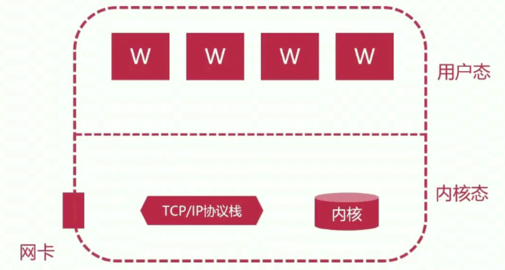

# 3、核心指令-Nginx基础应用

## 3-1 配置文件 main 段核心参数用法

### 核心参数

- **user**：指定运行 nginx 的 worker 子进程的**属主**和**属组**，其中属组可以不指定
  - 形式：user USERNAME [GROUP] ——> 中括号括起来说明是可选
  - 示例：user nginx nginx;

- **pid**：指定运行 nginx 的 **master 主进程的 pid** 文件存放路径
  - 形式：pid DIR
  - 示例：pid /opt/nginx/logs/nginx.pid;

- **worker_rlimit_nofile**：指定 worker 子进程可以打开的最大文件句柄数
  - 形式：worker_rlimit_nofile number
  - 示例：worker_rlimit_nofile 20480;

- **worker_rlimit_core**：指定  worker 子进程异常终止后的 core 文件，用于记录分析问题
  - 形式：worker_rlimit_core size
  - 示例：
    - worker_rlimit_core 50M;
    -  working_directory /opt/nginx/tmp;    # core 文件的存放目录得指定（**nginx 用户必须有写权限！**）

- **worker_processes**：指定 nginx 启动的 worker 子进程数量
  - 形式：worker_processes number | auto
  - 示例：
    - worker_processes 4;
    - worker_processes auto;

- **worker_cpu_affinty**：将每个 **worker 子进程**与我们的 **CPU 物理核心**绑定
  - 形式：worker_cpu_affinity cpumask1 cpumask2 ...
  - 示例：
    - worker_cpu_affinity 0001 0010 0100 1000;    # 4 个物理核心，4 个 worker 子进程
    - worker_cpu_affinity 00000001 00000010 00000100 00001000 00010000 00100000 01000000 10000000;    # 8 个物理核心，8 个 worker 子进程
    - worker_cpu_affinity 01 10 01 10;    # 2 个物理核心，4 个子进程
  - **注意：**将每个 worker 子进程与特定 CPU 物理核心绑定，优势在于：避免同一个 worker 子进程在不同的 CPU 核心上切换，缓存失效，降低性能；**其并不能真正的避免进程切换**。

- **worker_priority**：指定 worker 子进程的 nice 值，以调整运行 nginx 的优先级，通常设定为负值，以优先调用 nginx。
  - 形式：worker_priority number
  - 示例：worker_priority -10;
  - **注意**：Linux 默认进程的优先级值是 120，**值越小越优先**；nice 设定范围为 -20 到 +19.

- **worker_shutdown_timeout**：指定 worker 子进程优雅退出时的超时时间
  - 形式：worker_shutdown_timeout time
  - 示例：worker_shutdown_timeout 5s; 

- **daemon**：设定 nginx 的运行方式，前台还是后台，前台用户调试，后台用于生产
  - 形式：daemon on | off
  - 示例：daemon off

- **lock_file**：  负载均衡互斥锁文件存放路径
  - 语法：lock_file file
  - 默认配置：lock_file logs/nginx.lock
  - 推荐配置：lock_file logs/ningx.lock

- **timer_resolution**：worker 子进程内部使用的计时器精度，调整时间间隔越大，系统调用越少，有利于性能提升；反之，系统调用越多，性能下降。这具体是啥意思呢？看看下面的**客户端请求处理流程**
  - 形式：timer_resolution time
  - 示例：timer_resolution 100ms;

**客户端请求处理流程**



假设上面的大框框就是 nginx 服务器，这个 nginx 服务器启动了 4 个 worker 子进程来响应客户端发送过来的请求。nginx 自身运行在用户态，操作系统是有内核态的，内核态用来处理 TCP/IP 协议（数据包咋处理的都是由内核态处理），或者是调用磁盘 I/O ，获取磁盘上的文件信息等系统操作，总的来说，就是内核态和磁盘上的文件打交道， 把内容再返回给用户态。

假设有一个用户，发送了个 TCP 连接到网卡上。网卡收到了之后，把 TCP 连接传来的数据拆包，然后给 TCP/IP 协议栈。TCP/IP 协议栈继续拆数据包，拆完了看看三层 IP 是不是自己的 IP，如果是的话就会继续拆包拆到四层，然后看一下端口是谁。如果这个连接是向 80 端口发起的服务，**内核态**知道 80 端口就是被**用户态**的某一个应用程序所提供的服务（比如 nginx 服务）所监听，这个时候 TCP/IP 协议栈就会将用户请求数据包继续扔给用户态空间的 worker 子进程，让其继续去处理，这个时候请求已经到达用户态。

假如请求已经到达了用户态以后，我们要频繁地获取系统时间，或者是跟磁盘打交道，那就必须发送请求内核态来处理，这就产生了系统调用，这个系统调用自身来说是很耗费性能的。这就意味着，如果你的时间精度要求高，比如间隔是 10ms，那就是说 10ms 之内要频繁地从用户态切换到内核态，这就会影响到性能。这个时候就有了 **timer_resolution** 来尽可能减少用户态和内核态之间的切换。

`/opt/nginx/conf/nginx.conf`

```shell
user nginx nginx;
worker_processes auto;
pid /opt/nginx/logs/nginx.pid;
worker_rlimit_nofile 12500;
worker_rlimit_core 50M;
# 需要创建这个目录，并把用户改成 nginx（chown -R nginx.nginx /opt/nginx/tmp）
working_directory /opt/nginx/tmp;
# 如果上面使用了 auto，且不知道自己 CPU，可以用 lscpu 来查看
worker_cpu_affinity 0001 0010 0100 1000;
worker_priority -10; # 让 cpu 优先处理
worker_shutdown_timeout 5s;
timer_resolution 100ms;
lock_file logs/nginx.log; # 这是相对路径，都是相对 /opt/nginx 的
daemon on;
```

```shell
# 写完了以后测试 nginx 配置文件写的有没有语法错误
/opt/nginx/conf/nginx.conf -t
# 重新加载
/opt/nginx/sbin/nginx -s reload
```

## 3-2 配置文件 events 段核心参数用法

### 核心参数

- **use**：nginx 使用何种事件驱动模型
  - 语法：use method
  - method 可选值：select、poll、kqueue、**epoll（高并发下比较常用）**、/dev/poll、eventport
  - 默认配置：无
  - 推荐配置：**不指定，让 nginx 自己选择**

- **worker_connections**：worker 子进程能够处理的最大并发连接数
  - 语法：worker_connections number
  - 默认配置：worker_connections 1024
  - 推荐配置：worker_connections (65535/worker_processes) | 65535（直接配置 65535 也没啥问题，只是 CPU 达不到，但是会尽可能去达到这个水平）

- **accept_mutex**：是否打开负载均衡互斥锁
  - 语法：accept_mutex on | off
  - 可选值：on、off
  - 默认配置：accept_mutex off
  - 推荐配置：accept_mutex on

如果设置成了 off，那么一个请求来的时候，master 进程会把请求分发给所有的 worker 子进程；如果设置成了 on，那么一个请求来的时候，master 进程只会将其分发给一个 worker 子进程。

- **accept_mutex_delay**：新连接分配给 worker 子进程的超时时间
  - 语法：accept_mutex_delay time
  - 默认配置：accept_mutex_delay 500ms
  - 推荐配置：accept_mutext_delay 200ms

这个配置，只有在 **accept_mutex: on** 的时候才是有意义的。它的意思就是说，如果现在来了个请求，master 进程分发这个请求，现在轮到第二个 worker 子进程来处理了，但是它现在还有好多事情要干，如果超过了**超时时间**没有回应 master，master 进程就只能把这个请求再分发给下一个 worker 子进程。

- **muti_accept**：  worker 子进程可以接收的新连接个数
  - 语法：multi_acception on | off
  - 可选值：on、off
  - 默认配置：multi_accept off
  - 推荐配置：multi_accept on

`/opt/nginx/conf/nginx.conf`

```shell
# main 段的配置
# ...

events {
	worker_connection 17500;
	accept_mutex on;
	accept_mutex_delay 100ms;
	multi_accept on;
}
```

## 3-3 server_name 指令用法

### 语法结构

- 匹配到了域名，就用对应的虚拟主机来处理
- 语法：server_name name1 name2 name3 ... ;
- 示例：
  - server_name www.nginx.com;
  - server_name *.nginx.org;
  - server_name www.nginx.org *.nignx.org;
- 四种写法：
  - server_name www.nginx.com
  - server_name *.ningx.com
  - server_name www.nginx.*
  - server_name ~^www\\.nginx\\..*$    以 ~ 开头说明是个正则表达式匹配

### 多域名如何匹配

```shell
# 假如先定义四个虚拟主机，然后思考它们的优先级（谁先匹配）
server {
	server_name www.nginx.org; # 精确匹配
}
server {
	server_name www.nginx.*; # 右侧通配符匹配
}
server {
	server_name *.nginx.org; # 左侧通配符匹配
}
server {
	server_name ~^www\.nginx\..*$; # 正则表达式匹配
}
```

- 匹配优先级 **从高到低** 为：精确匹配、左侧通配符匹配、右侧通配符匹配、正则表达式匹配

## 3-4 root 和 alias 的区别

这两者都是用来指定 uri 和磁盘上具体静态资源的映射关系。

### 语法结构

- root：
  - 语法：root path    **（通常 path 目录下存放着我们的 html 文件）**
  - 上下文：http server location if（4 个段都能用）
- alias：
  - 语法：alias path
  - 上下文：location

### 共同点与区别

- 相同点：URI 到磁盘文件的映射
- 区别：root 会将定义路径与 URI 叠加；alias 只取定义路径

```shell
location /picture {
	root /opt/nginx/html/picture;
}
# 客户端请求 www.test.com/picture/1.jpg ，则对应磁盘映射路径为 /opt/nginx/html/picture/picture/1.jpg

location /picture {
	alias /opt/nginx/html/picture/;
}
# 客户端请求 www.test.com/picture/1.jpg，则对应磁盘映射路径为 /opt/nginx/html/picture/1.jpg
```

**注意：**使用 alias 的时候，末尾一定加斜杠（/）。alias 只能位于 location 块中。

## 3-5 location 的基础用法

### 语法结构

- 语法：location [ = | ~ | ~* | ^~ ] uri { ... }**（中括号里面的为可选）**
- 上下文：server location

| 匹配规则     | 含义                   | 示例                               |
| ------------ | ---------------------- | ---------------------------------- |
| =            | 精确匹配               | location = /images/ { ... }        |
| ~            | 正则匹配，区分大小写   | location ~ \\.(jpg\|gif)$ { ... }  |
| ~*           | 正则匹配，不区分大小写 | location ~* \\.(jpg\|gif)$ { ... } |
| ^~           | 匹配到即停止搜索       | location ^~ /images/ { ... }       |
| 不带任何符号 |                        | location / { ... }                 |

### location 指令中匹配规则的优先级

优先级**从高到低**依次为：=、^~、~、~*、不带任何字符

## 3-6 location 中 URL 结尾的斜线

### URL 写法区别

```shell
# 不带斜线（/）
location /test {
	...
}

# 带斜线（/）
location /test/ {
	...
}
```

- **不带 /**：如果是 /test（location 里面啥都不写），首先 nginx 还是会将其当作一个目录来进行处理，会去找 test 目录（注意，一定是文件夹）是否存在，如果存在那就会找 test 目录是否有 index.html。但是，如果找不到 test 目录的话，会有另外的处理机制，那就是会将 test 当成一个文件来查找，如果 test 文件存在，那就会把 test 文件中的内容直接返回。
- **带 /**：如果是 /test/，它会直接将其当成一个目录来进行查找，如果存在，那就会去找 test 目录下是否有 index.html 文件。但是如果 test 目录不存在，它不会将 test 当成个文件再来查找。

## 3-7 stub_status 模块用法

提供 nginx 监控页面功能的模块。该模块可以实现我们在 web 应用中实时去查看 nginx 的状态。比如当前正在处理用户的请求连接数量等等，都可以监控。

它默认不会编译进 nginx ，所以在编译安装的时候要加上：--with-http_stub_status_module

### 语法结构

- 指令：stub_status;
- 低于 1.7.5 版本：stub_status on;
- 上下文：server location 

```shell
# 配置示例
location /uri { # 这个 uri 尽可能显得难猜点，别被用户猜到
	stub_status;
}
```

```shell
# 显示出的效果
Active connections: 2
server accepts handled requests
 883 883 928
Reading: 0 Writing: 1 Waiting: 1
```

| 状态项             | 含义                     |
| ------------------ | ------------------------ |
| Active connections | 活跃的连接数量           |
| accepts            | 接受的客户端连接总数量   |
| handled            | 处理的客户端连接总数量   |
| requests           | 客户端总的请求数量       |
| Reading            | 读取客户端的连接数       |
| Writing            | 响应数据到客户端的连接数 |
| Waiting            | 空闲客户端请求连接数量   |

### 内嵌变量

| 变量名               | 含义                     |
| -------------------- | ------------------------ |
| $connections_active  | 同 Active connections 值 |
| $connections_reading | 同 Reading 值            |
| $connections_writing | 同 Writing 值            |
| $connections_waiting | 同 Waiting 值            |

