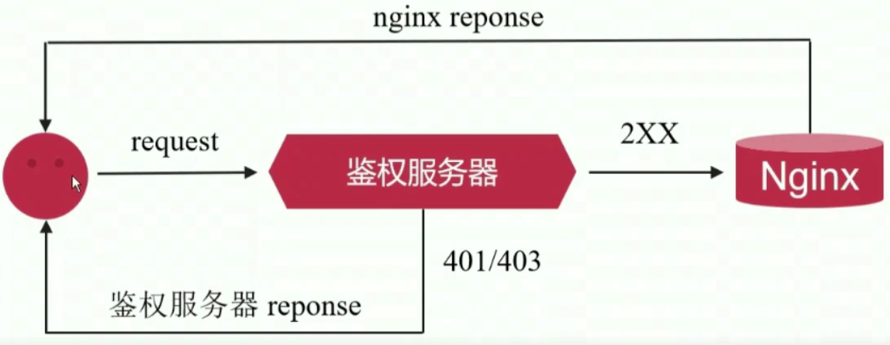

# 4、HTTP 核心模块-Nginx应用进阶

## 4-1 connection 和 request

### 基本含义

- **connection**：连接，就是常说的 tcp 连接，三次握手，状态机
- **request**：请求，例如 http 请求，无状态的协议
- **request** 是 必须建立在 **connection** 之上

## 4-2 对 connection 做限制的 limig_conn 模块

### limig_conn 模块基本功能

- 用于限制客户端并发连接数
- 默认编译进 nginx，通过 --without-http_limit_conn_module 来禁用。
- 使用共享内存（也就是在这个内存中保存指定客户端的连接数），对所有 worker 子进程生效。

### 常用指令

- limit_conn_zone：定义共享内存
  - 语法：**limit_conn_zone key zone=name:size**   这个 **key** 是用来标识客户端的唯一性的。通常这个 key 我们会使用一个变量叫做 remote_addr，这个变量是 nginx 内置的。也就是说当我们部署好 nginx 之后，客户端发来一个请求，你的 nginx 会将客户端 ip 赋值给  remote_addr，ip 就能当作一个唯一性标识。**zone** 后面跟的 name 是一个名称（随便取啥都可以）。**size** 是定义共享内存的空间。
  - 默认值：无
  - 上下文：http
  - 示例：**limit_conn_zone $binary_remote_addr zone=addr:10m**    binary_remote_addr 和 remote_addr 差不多是一个东西，都保存客户端的 ip。不同之处在于 binary_remote_addr 只使用 4 个字节的空间，而 remote_addr 会使用 7~15 个字节的空间。
- limit_conn_status：定义限制发生的时候返回给客户端的状态
  - 语法：**limit_conn_status code**    
  - 默认值：**limit_conn_status 503**
  - 上下文：http、server、location
- limit_conn_log_level：定义限制发生的时候在日志中记录的日志信息等级
  - 语法：**limit_conn_log_level info | notice | warn | error**
  - 默认值：**limit_conn_log_level error;**
  - 上下文：http、server、location
- limit_conn：定义限制客户端的并发连接数
  - 语法：**limit_conn zone number;**    zone 就是上面定义共享内存的时候定义的 zone 的名字
  - 默认值：无
  - 上下文：http、server、location

`/opt/nginx/conf/nginx.conf`

```shell
http {
	limit_conn_zone $binary_remote_addr zone=limit_addr:10m; # 定义共享内存空间
	server {
		listen 80;
		server_name localhost;
		
		location / {
			root html;
			index index.html index.htm;
			# 对系统的首页进行限制连接数
			limit_conn_status 503;
			limit_conn_log_level warn;
			limit_conn limit_addr 2; # 定义并发连接的限制是 2
			limit_rate 50; # 响应给客户端的时候速率是 50 字节/秒，这样有利于显示
		}
	}
}
```


## 4-3 对 request 处理速率做限制的 limit_req 模块

### limit_req 模块基本功能

- 用于限制客户端处理请求的平均速率
- 默认编译进 nginx，通过 --without-http_limit_req_module 来禁用
- 使用共享内存，对所有 worker 子进程生效
- 使用的**限流算法**：**[leaky_bucket](https://blog.51cto.com/leyew/860302)**   这个算法主要的作用就是把突发的流量变得平稳

### 常用指令

- limit_req_zone：定义共享内存，也可以限定请求

  - 语法：**limit_req_zone key zone=name:size rate=rate;**    rate 就是限定请求的速率
  - 默认值：无
  - 上下文：http
  - 示例：**limit_req_zone $binary_remote_addr zone=one:10m rate=2r/m;**    2r/m 表示每分钟处理两个请求，而且这两个请求也是平均分布的，比如 30 秒之后处理一个请求，再过 30 秒再处理一个请求。

- limit_req_status：限制触发时返回的状态码

  - 语法：**limit_req_status code;**    
  - 默认：**limit_req_status 503;**
  - 上下文：http、server、location;

- limit_req_log_level：限制触发时，写在日志的日志等级

  - 语法：**limit_req_log_level info | notice | warn | error**;
  - 默认：**limit_req_log_level error;**
  - 上下文：http、server、location;

- limit_req：此指令用于设置共享的内存**zone**和最大的突发请求大小，若请求速率超过了**limit_req_zone**中指定的**rate**但小于**limit_req** 中的**burst**，则进行延迟处理，若再超过**burst**，就可以通过设置nodelay对其进行丢弃处理。

  - 语法：**limit_req zone=name [ burst=number ] [ nodelay | delay=number ];**   
  - 默认：无
  - 上下文：http、server、location
  - 示例：
    - limit_req zone=one;
    - limit_conn zone=one burst=5 nodelay;

  ```shell
  http {
  	limit_req_zone $binary_remote_addr zone=limit_req:15m rate=2r/m;
  	server {
  		listen 80;
  		server_name localhost;
  		
  		location / {
  			root html;
  			index index.html index.htm;
  			# 限定请求数
  			limit_req_status 504;
  			limit_req_log_level notice;
  			limit_req zone=limit_Req;
  			# limit_req zone=limit_req burst=7 nodelay; 
  		}
  	}
  }
  ```


## 4-4 限制特定 IP 或网段访问的 access 模块

通过限制特定 IP 或网段访问，从而能够实现 nginx 的访问控制。

### 指令集

- allow
  - allow address | CIDR | UNIX | all;
  - 默认值：无
  - 上下文：http、server、location、limit_except
  - 示例：allow 192.168.0.10;    放行 192.168.0.10 这个特定 IP
- deny
  - deny address | CIDR | UNIX | all;
  - 默认值：无
  - 上下文：http、server、location、limit_except
  - 示例：allow 192.168.0.0/24;   拒绝 192.168.0.0 这个网段

```shell
location / {
	deny 192.168.1.1;
	allow 192.168.1.0/24; # 先拒绝掉上面的（上面的这句在这个网段之内），然后再放行下面的。
	allow 10.1.1.0/16;
	allow 2001:0db8::/32;
	deny all; # 除上面允许的网段之外，全部都拒绝掉。
}
```

## 4-5 限制特定用户访问的 auth_basic 模块

针对特定的 Url，可以让它提供账号或者密码来进行访问。

- 基于 HTTP Basic Authentication 协议进行用户名密码认证
- 默认编译进 Nginx，通过 --without-http_auth_basic_module 禁用

### 指令

- auth_basic：决定是否打开 ”用户名密码验证“ 这个功能
  - 语法：**auth_basic string | off;**
  - 默认值：auth_basic off;
  - 上下文：http、server、location、limit_except
- auth_basic_user_file：指定密钥文件，也就是说来存放用户名和密码，这个文件可以通过**生成密码文件工具**来生成。
  - 语法：**auth_basic_user_file file;**
  - 默认值：-
  - 上下文：http、server、location、limit_except

### 生成密码文件工具

- 可执行程序：htpasswd
- 所属软件包：httpd-tools
- 生成新的密码文件：htpasswd -bc encrypt_pass jack 123456   （-c 是 create 的意思）
- 添加新用户密码：htpasswd -b encrypt_pass mike 123456
- 可以去 [这里](https://centos.pkgs.org/7/centos-x86_64/httpd-tools-2.4.6-93.el7.centos.x86_64.rpm.html) 下载软件包噢 ^_^

`/opt/source`

```shell
# 下载软件包
wget http://mirror.centos.org/centos/7/os/x86_64/Packages/httpd-tools-2.4.6-93.el7.centos.x86_64.rpm
# 解压
rpm -ivh httpd-tools-2.4.6-93.el7.centos.x86_64.rpm
# 创建 auth 文件夹
cd /opt/nginx
mkdir auth
cd auth

# 创建用户 jack，加密文件的名字新建为 encrypt_pass
htpasswd -b -c encrypt_pass jack 123456
# 创建用户 mike
htpasswd -b encrypt_pass mike 123456

# 然后去配置文件中引用这个文件
vim /opt/nginx/conf/nginx.conf
```

`/opt/nginx/conf/nginx.conf`

```shell
http {
	server {
		location /bbs/ {
			root html;
			index index.html;
			auth_basic "test user password: ";
             auth_basic_user_file /opt/nginx/auth/encrypt_pass; # 最好用绝对路径
		}
	}
}
```

- 检查：/opt/nginx/sbin/nginx -t
- 重启：/opt/nginx/sbin/nginx -s reload

## 4-6 基于 HTTP 响应状态码做权限控制的 auth_request 模块

实际生产环境中，可能会搭建一个鉴权的服务器，当你想要访问特定的模块的时候，你需要跟鉴权服务器发送请求，鉴权服务器通过以后才能正常地访问业务系统。

- 基于子请求受到的 HTTP 响应码做访问控制
- 默认未编译进 nginx，通过 --with-http_auth_request_module 启用

### 原理

- 用户 ——> 鉴权服务器 ——> Nginx
- 用户正常发起一个 request，如果没有鉴权服务器，那么 request 会直接发给 nginx，然后由 nginx 直接返回；如果这个时候我们想做一点鉴权的工作，那么就可以用 auth_request 模块搭建一个鉴权服务器，那么 request 会首先发给鉴权服务器，由鉴权服务器做完处理之后，它会有一些状态码（比如 401，403）产生，如果是 401 或 403，那么说明鉴权失败，鉴权服务器直接把带有失败信息的响应返回给用户；如果是 2开头的状态码，那说明鉴权通过，这样鉴权服务器会再发送一个请求给 nginx，让 nginx 做处理，处理完直接把响应返回给用户。



### 指令

- auth_request
  - 语法：auth_request uri | off
  - 默认值：auth_request off;
  - 上下文：http、server、location
- auth_request_set
  - 语法：auth_request_Set $variable value;
  - 默认值：-
  - 上下文：http、server、location

```shell
# 对 /private/ 这个 uri 做访问控制
location /private/ {
	# 当访问 /private/ 这个 uri 的时候，把它指向另外鉴权模块的 uri
	auth_request /auth;
}
location /auth {
	# 反向代理到下面这个鉴权服务器上做鉴权，假如这个 uri 做完鉴权以后返回的状态码 2xx 开头，这就代表鉴权成功，成功了以后 /private 才能正确返回自己下面的 web 内容；如果鉴权失败，那就直接返回这个 uri 的状态码和 web 内容。
	proxy_pass http://127.0.0.1:8080/verify;
	proxy_pass_request_body off;
	proxy_set_header Content-Length "";
	proxy_set_header X-Original-URI $request_uri;
}
```

## 4-7 rewrite 模块中的 return 指令

rewrite 模块主要实现了对 url 的重写。

### return 功能

- 停止处理请求，直接返回响应码或重定向到其他 URL
- 执行 return 指令后，location 中后续指令将不会被执行

```shell
location / {
	...
	return 404;
	...
}
```

### return 语法结构

- 语法
  - return code [text];
  - return code URL;
  - return URL;
- 默认值：-
- 上下文：server、location、if

## 4-8 rewrite 模块中的 rewrite 指令

### rewrite 功能

- 根据指定正则表达式匹配规则，重写 URL

### rewrite 语法结构

- 语法：rewrite regex replacement [flag];
- 默认值：-
- 上下文：server、location、if
- 示例：rewrite /images/(.*\\.jpg)$ /pic/$1;  $1 是前向引用的意思，也就是说 1 的内容差不多就是 (.*\\.jpg)

### rewrite 中的 flag

flag 可选值及含义

- last：对重写后的 url 发起新请求，再次进入 server 段，重试 location 中的匹配
- break：直接使用重写后的 url，不在匹配其他 location 中语句
- redirect：返回 302 临时重定向
- permanent：返回 301 永久重定向

### break 和 last

```shell
location /url_1 {
	...
	rewrite ... break; # 重写后的 url 会直接去磁盘上找对应的文件
	...
}
location /url_2 {
	...
	rewrite ... last; # 重写后的 url 会继续走 location（从 /url_1 开始，往下匹配）
	...
}
location /url_3 {
	...
	...
	...
}

```

```shell
# 1、思考下面的匹配顺序
server {
	listen 80;
	server_name www.kongli.top;
	root html;
	location /search {
		rewrite ^/(.*) http://www.cctv.com permanent;
	}
	location /images {
		rewrite /images/(.*) /pics/$1;
	}
	location /pics {
		rewrite /pics/(.*) /photos/$1;
	}
	location /photos {
    }
}
# 当浏览器中输入 www.kongli.top/search/a 的时候，它会被重定向到 www.cctv.com 这个网站
# 当浏览器中输入 www.kongli.top/images/test.html 的时候，它会首先重写到 /pics/test.html ，然后再重写到 photos/test.html。这和在后面加 last：rewrite /images/(.*) /pics/$1 last; 效果一样，都会从头开始匹配 location
```

```shell
# 2、思考下面的匹配顺序
server {
	listen 80;
	server_name www.kongli.top;
	root html;
	location /images {
		rewrite /images/(.*) /pics/$1 break;
	}
	location /pics {
		rewrite /pics/(.*) /photos/$1;
	}
	location /photos {
    }
}
# 在第二个 location 末尾加上了 break，那就说明它不会再从头匹配 location，也就是说如果你输入了 www.kongli.top/images/test.html ，会直接被重写到 /pics/test.html。
```


## 4-9 return 和 rewrite 指令执行顺序

```shell
server {
	listen 80;
	server_name www.kongli.top;
	root html;
	location /images {
		rewrite /images/(.*) /pics/$1 last;
		return 200 "return 200 in /images";
	}
	location /pics {
		rewrite /pics/(.*) /photos/$1;
		return 200 "return 200 in /pics";
	}
	location /photos {
		return 200 "return 200 in /photos";
    }	
}
# 如果输入 www.kongli.top/images/test.html；首先，它会将 /images/test.html 重写到 /pics/test.html，并且后面有 last，所以会重新定位到 location /pics 里面
```


## 4-10 rewrite 模块中if指令


## 4-11 autoindex 模块用法


## 4-12 Nginx 变量的分类


## 4-13 TCP 连接相关变量


## 4-14 发送 HTTP 请求变量


## 4-15 处理 HTTP 请求变量


