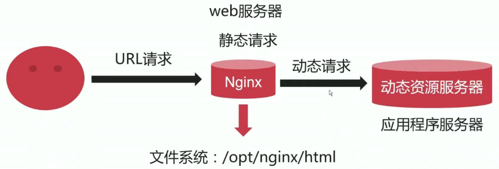
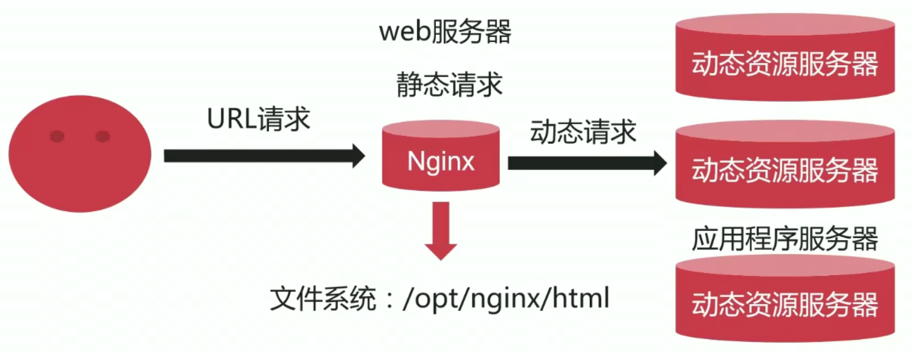
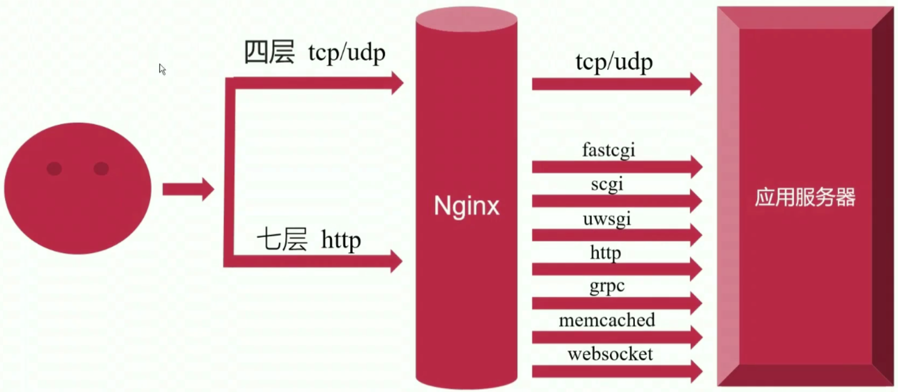

# 5、场景实践-反向代理【企业案例|焦点效应】

## 5-1 反向代理基础原理

### 概念定义

- 反向代理服务器介于用户和真实服务器之间，提供请求和响应的中转服务
- 对于用户而言，访问反向代理服务器就是访问真实服务器（用户无感知）
- 反向代理可以有效降低服务器的负载消耗，提升效率


真实服务器通常来说是个应用服务器，比如说现在在内网中有一个应用服务器，它可能是一个 java 容器，现在用户想要去访问内网中这样一个服务器的时候，由于用户通常是在互联网之中的，但是真实服务器通常是部署在内网之中的，所以直接去访问是无法访问到的。所以我们通常在中间加上个代理服务器，这个代理服务器通常位于公司系统的边缘节点，这个边缘节点既能和我们的内网保持连通，同时我们会为它配置一个公网 ip 地址，确保域名可以解析到这个代理服务器上来，从而使得用户的请求可以到达这个代理服务器。这个时候代理服务器就充当了一个中间人的角色。

现在用户想要去访问真实服务器（但是他并不知道真实服务器在哪里），它会将 request 请求转发给代理服务器，然后代理服务器会将这个请求转发给真实的服务器。真实的服务器收到请求并做了一些操作和处理之后，把得到的结果响应给代理服务器，代理服务器拿到响应之后再把响应传输给用户。

### 用反向代理的优势：

- **隐藏真实服务器**
- **便于横向扩充后端动态服务。**所有的后端的应用程序服务器我们称之为动态资源服务器，它会根据不同的请求进行计算得到不同的结果。这种情况下，通过代理服务器来将请求转发给真实服务器，有一个最大的好处，那就是真实服务器不够的话，可以进行横向的扩充。这就是负载均衡。

- **动静分离，提升系统健壮性**


## 5-2 动静分离

### 概念定义

动静分离是指在 web 服务器架构中，将静态页面与动态页面或者静态内容接口和动态内容接口分开不同系统访问的架构设计方法，进而提升整个服务器访问性能和可维护性。（简单来说就是静态资源由一个系统来处理，动态资源由一个系统来处理）

### web 资源分类

- 静态资源：jpg/css/js.html
- 动态资源：jsp/asp/php

### web 请求

- 静态请求 ——> 静态资源服务器
- 动态请求 ——> 动态资源服务器

有时候静态资源服务器不止一台，因为它的响应能力很强，因为它不需要后端进行处理或者运算，它直接索引我们放在磁盘上的文件然后返回就行了。

### nginx 处理静态资源和动态资源

假设现在有一个用户给 nginx 发送了一个 url 请求。nginx 拿到了这个 url 请求之后（这个 url 中可能有静态资源和动态资源），对于静态请求 nginx 自身是能够处理的，也就是说 nginx 会在文件系统的某一个目录（比如 /opt/nginx/html）放上所有的静态资源文件，这时候它会直接将这些静态资源返回；

但是对于动态请求 nginx （ web 服务器；只能处理静态资源）自身是无法处理的。这个时候 nginx 会通过反向代理，将动态请求转发到动态资源服务器（其实也就是应用程序服务器）。动态资源服务器处理完之后会将处理结果返回给 nginx，然后 nginx 将结果再返回给用户，由用户进行浏览器的展示。



### 反向代理的好处（这里要再提一提啦）

既然用户和真实服务器之间加了个代理服务器（所有的 request 都要进行两次，网络连接也有消耗），**它为啥还能够提升效率呢？**通常后端的动态资源服务器计算能力比较差，如果 nginx 收到的并发请求越来越多（并且这里面很多都是动态请求），那么可以横向地扩充动态资源服务器，这样就可以极大地提升吞吐量。

总的来说就是反向代理的架构可以横向地扩充服务器，从而提升系统的健壮性。




## 5-3 使用 nginx 作为反向代理时支持的协议

### 协议支持图



可以将用户来的流量大致分为四层 tcp/udp 和七层 http 的反向代理情景。

### 四层 tcp / udp 反向代理情景

在四层（用户发 tcp 和 udp 给 nginx），nginx 只能定位到 **ip 加端口**，它和很多的应用特性是没有关系的，因此无法判断应用特性。所以 nginx 做的工作并不多（也就是说用户过来的是 tcp 流量，那么 nginx 传输给应用服务器的也只能是 tcp 流量）。

### 七层 http 反向代理情景

在七层（用户发 http 给 nginx），nginx 可以将 http 的流量转化为后面的不同的七种协议然后发送给应用服务器。

## 5-4 用于定义上游服务的 upstream 模块

### 基本功能

nginx 在反向代理服务情形下，需要把动态请求转发给上游的应用程序服务器。那么这个上游的应用程序服务器在哪里，它的 ip 地址是什么，端口是什么，亦或是域名是什么，等信息我们必须在 nginx 里面明确地告知，这样它才能找到对应的上游应用服务。**upstream 就是用来定义上游服务器的相关信息。**

### 指令集

- upstream：段名，以 { 开始，以 } 结束，中间定义上游服务 URL。
- server：定义上有服务地址
- zone：定义共享内存，用于跨 worker 子进程
- keepalive：对上游服务启用长连接
- keepalive_requests：一个长连接最多请求个数
- keepalive_timeout：空闲情形下，一个长连接的超时时长
- queue：所有上有服务器不可用时，请求会被放到队列中等待（开源 nginx 版本中不可用，商业版可用）

- hash：哈希负载均衡算法
- ip_hash：依据 ip 进行哈希计算的负载均衡算法
- least_conn：最少连接数负载均衡算法
- least_time：最短响应时间负载均衡算法
- random：随机负载均衡算法

## 5-5 upstream 模块指令用法详解

- upstream 默认已经被编译进 nginx
- 可以通过 --without-http_upstream_module 来禁用。

### 基本用法

- **upstream**：
  - 语法：upstream name { ... }
  - 默认值：无
  - 上下文：**http**（也就是说与 server 段是平级的）

```shell
# 基本用法
upstream {
	...
	...
}
```

- **server**

  - 语法：server address [parameters];（address 就是 ip 地址 + 端口）

  - parameters 可选值

    | 可选参数          | 含义                                                         |
    | ----------------- | ------------------------------------------------------------ |
    | weight=number     | 权重值，默认为1。权重越大处理能力越强                        |
    | max_conns=number  | 上游服务器的最大并发连接数                                   |
    | fail_timeout=time | 判断上游服务器不可用的判定时间（比如 10s 内 3 次连接失败就判定你这服务器不可用，这里的 10s 就是 fail_timeout 指定的 time；**但是需要注意的是：**nginx 处理连接的速度很快，10s 的意思是，如果其中有 3s 的时间连接了 3次这台服务器并失败，那么 nginx 在剩下的 7s 中就不会再调度请求给这台服务器了，但是再下一个 10s 的时候又会再次调度请求给这服务器） |
    | max_fails=number  | 判断服务器不可用的检查次数（比如上面定义的 3 次，一定时间内连接 3 次失败，那就判定你这服务器不可用） |
    | backup            | 备份服务器，正常情况下 nginx 不会调度请求给它；仅当其他服务器都不可用时，会将请求调度给它。 |
    | down              | 标记服务器长期不可用，离线维护                               |

  - 默认值：无

  - 上下文：**upstream**

- **keepalive**：可以通过 keepalive 启用与上游服务器的长连接功能。在启用长连接的情况下，假设某一时刻有很大的并发请求都调度个某个上游服务器，上游服务器处理完之后把结果都返回给 nginx，这个时候我们知道长连接可能并不会关闭。也就是说如果有 5000 个请求一次性处理完之后就没有任何请求啦，但是如果这 5000 请求都是长连接，那么这 5000 个长连接就会处于空闲的状态（也就是 tcp 连接还保持着，但是上面没有 http 去发送），这就会造成很大的浪费。**所以**：在 keepalive 后面加上 connections，意思就是限制每个 worker 子进程与上游服务器**空闲长连接的最大数量**。
  - 语法：keepalive connections;
  - 默认值：无
  - 上下文：upstream
  - 示例：keepalive 16;

- **keepalive_requests**：单个长连接可以处理的最多 http 请求个数
  - 语法：keepalive_requests number;
  - 默认值：keepalive_requests 100;
  - 上下文：upstream

- **keepalive_requests**：空闲长连接的最长保持时间
  - 语法：keepalive_timeout time;
  - keepalive_timeout 60s;
  - 上下文：upstream

- **queue**：所有上有服务器不可用时，请求会被放到队列中等待（开源 nginx 版本中不可用，商业版可用）
  - 语法：queue number [timeout=time];
  - 默认值：无
  - 上下文：upstream
  - 示例：queue 100 timeout=30s：队列中最多能放 100 个连接

### 配置示例

```shell
upstream back_end {
	server 127.0.0.1:8080 weight=3 max_conns=1000 fail_timeout=10s max_fails=2;
	keepalive 32; # 最大空闲长连接数是 32
	keepalive_requests 50; # 每个长连接请求最大为 50
	keepalive_timeout 30s; # 每个空闲长连接最大保持时长 30s
}
```

## 5-6 配置一个可用的上游应用服务器


## 5-7 配置 nginx 反向代理实例


## 5-8 proxy_pass 指令用法常见误区


## 5-9 代理场景下 nginx 接受用户请求包体的处理方式


## 5-10 代理场景下 nginx 如何更改发往上游的用户请求


## 5-11 代理场景下 nginx 与上游建立连接细节


