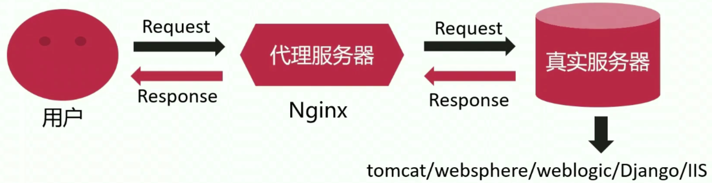

# 5、场景实践-反向代理【企业案例|焦点效应】

## 5-1 反向代理基础原理

### 概念定义

- 反向代理服务器介于用户和真实服务器之间，提供请求和响应的中转服务
- 对于用户而言，访问反向代理服务器就是访问真实服务器（用户无感知）
- 反向代理可以有效降低服务器的负载消耗，提升效率

真实服务器通常来说是个应用服务器，比如说现在在内网中有一个应用服务器，它可能是一个 java 容器，现在用户想要去访问内网中这样一个服务器的时候，由于用户通常是在互联网之中的，但是真实服务器通常是部署在内网之中的，所以直接去访问是无法访问到的。所以我们通常在中间加上个代理服务器，这个代理服务器通常位于公司系统的边缘节点，这个边缘节点既能和我们的内网保持连通，同时我们会为它配置一个公网 ip 地址，确保域名可以解析到这个代理服务器上来，从而使得用户的请求可以到达这个代理服务器。这个时候代理服务器就充当了一个中间人的角色。

现在用户想要去访问真实服务器（但是他并不知道真实服务器在哪里），它会将 request 请求转发给代理服务器，然后代理服务器会将这个请求转发给真实的服务器。真实的服务器收到请求并做了一些操作和处理之后，把得到的结果响应给代理服务器，代理服务器拿到响应之后再把响应传输给用户。

既然用户和真实服务器之间加了个代理服务器（所有的 request 都要进行两次），**它为啥还能够提升效率呢？**后面会讲，学了再来写这里。

### 用反向代理的优势：

- **隐藏真实服务器**
- **便于横向扩充后端动态服务。**所有的后端的应用程序服务器我们称之为动态资源服务器，它会根据不同的请求进行计算得到不同的结果。这种情况下，通过代理服务器来将请求转发给真实服务器，有一个最大的好处，那就是真实服务器不够的话，可以进行横向的扩充。这就是负载均衡。

- **动静分离，提升系统健壮性**

## 5-2 动静分离

## 5-3 使用 nginx 作为反向代理时支持的协议

## 5-4 用于定义上游服务的 upstream 模块

## 5-5 upstream 模块指令用法详解

## 5-6 配置一个可用的上游应用服务器

## 5-7 配置 nginx 反向代理实例

## 5-8 proxy_pass 指令用法常见误区

## 5-9 代理场景下 nginx 接受用户请求包体的处理方式

## 5-10 代理场景下 nginx 如何更改发往上游的用户请求

## 5-11 代理场景下 nginx 与上游建立连接细节

