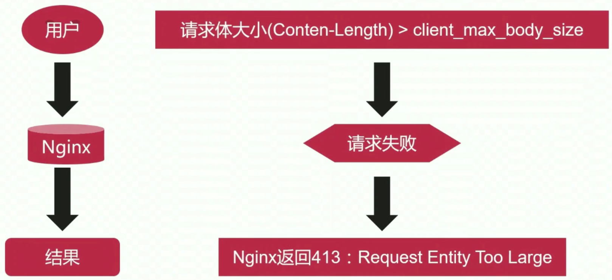
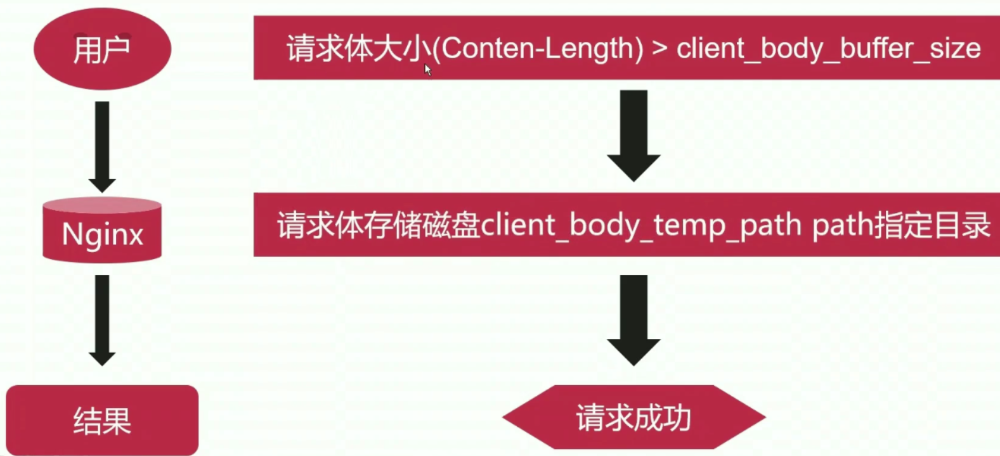

# 5、场景实践-反向代理

## 5-1 反向代理基础原理

### 概念定义

- 反向代理服务器介于用户和真实服务器之间，提供请求和响应的中转服务
- 对于用户而言，访问反向代理服务器就是访问真实服务器（用户无感知）
- 反向代理可以有效降低服务器的负载消耗，提升效率


真实服务器通常来说是个应用服务器，比如说现在在内网中有一个应用服务器，它可能是一个 java 容器，现在用户想要去访问内网中这样一个服务器的时候，由于用户通常是在互联网之中的，但是真实服务器通常是部署在内网之中的，所以直接去访问是无法访问到的。所以我们通常在中间加上个代理服务器，这个代理服务器通常位于公司系统的边缘节点，这个边缘节点既能和我们的内网保持连通，同时我们会为它配置一个公网 ip 地址，确保域名可以解析到这个代理服务器上来，从而使得用户的请求可以到达这个代理服务器。这个时候代理服务器就充当了一个中间人的角色。

现在用户想要去访问真实服务器（但是他并不知道真实服务器在哪里），它会将 request 请求转发给代理服务器，然后代理服务器会将这个请求转发给真实的服务器。真实的服务器收到请求并做了一些操作和处理之后，把得到的结果响应给代理服务器，代理服务器拿到响应之后再把响应传输给用户。

### 用反向代理的优势：

- **隐藏真实服务器**
- **便于横向扩充后端动态服务。**所有的后端的应用程序服务器我们称之为动态资源服务器，它会根据不同的请求进行计算得到不同的结果。这种情况下，通过代理服务器来将请求转发给真实服务器，有一个最大的好处，那就是真实服务器不够的话，可以进行横向的扩充。这就是负载均衡。

- **动静分离，提升系统健壮性**


## 5-2 动静分离

### 概念定义

动静分离是指在 web 服务器架构中，将静态页面与动态页面或者静态内容接口和动态内容接口分开不同系统访问的架构设计方法，进而提升整个服务器访问性能和可维护性。（简单来说就是静态资源由一个系统来处理，动态资源由一个系统来处理）

### web 资源分类

- 静态资源：jpg/css/js.html
- 动态资源：jsp/asp/php

### web 请求

- 静态请求 ——> 静态资源服务器
- 动态请求 ——> 动态资源服务器

有时候静态资源服务器不止一台，因为它的响应能力很强，因为它不需要后端进行处理或者运算，它直接索引我们放在磁盘上的文件然后返回就行了。

### nginx 处理静态资源和动态资源

假设现在有一个用户给 nginx 发送了一个 url 请求。nginx 拿到了这个 url 请求之后（这个 url 中可能有静态资源和动态资源），对于静态请求 nginx 自身是能够处理的，也就是说 nginx 会在文件系统的某一个目录（比如 /opt/nginx/html）放上所有的静态资源文件，这时候它会直接将这些静态资源返回；

但是对于动态请求 nginx （ web 服务器；只能处理静态资源）自身是无法处理的。这个时候 nginx 会通过反向代理，将动态请求转发到动态资源服务器（其实也就是应用程序服务器）。动态资源服务器处理完之后会将处理结果返回给 nginx，然后 nginx 将结果再返回给用户，由用户进行浏览器的展示。


### 反向代理的好处（这里要再提一提啦）

既然用户和真实服务器之间加了个代理服务器（所有的 request 都要进行两次，网络连接也有消耗），**它为啥还能够提升效率呢？**通常后端的动态资源服务器计算能力比较差，如果 nginx 收到的并发请求越来越多（并且这里面很多都是动态请求），那么可以横向地扩充动态资源服务器，这样就可以极大地提升吞吐量。

总的来说就是反向代理的架构可以横向地扩充服务器，从而提升系统的健壮性。


## 5-3 使用 nginx 作为反向代理时支持的协议

### 协议支持图


可以将用户来的流量大致分为四层 tcp/udp 和七层 http 的反向代理情景。

### 四层 tcp / udp 反向代理情景

在四层（用户发 tcp 和 udp 给 nginx），nginx 只能定位到 **ip 加端口**，它和很多的应用特性是没有关系的，因此无法判断应用特性。所以 nginx 做的工作并不多（也就是说用户过来的是 tcp 流量，那么 nginx 传输给应用服务器的也只能是 tcp 流量）。

### 七层 http 反向代理情景

在七层（用户发 http 给 nginx），nginx 可以将 http 的流量转化为后面的不同的七种协议然后发送给应用服务器。

## 5-4 用于定义上游服务的 upstream 模块

### 基本功能

nginx 在反向代理服务情形下，需要把动态请求转发给上游的应用程序服务器。那么这个上游的应用程序服务器在哪里，它的 ip 地址是什么，端口是什么，亦或是域名是什么，等信息我们必须在 nginx 里面明确地告知，这样它才能找到对应的上游应用服务。**upstream 就是用来定义上游服务器的相关信息。**

### 指令集

- upstream：段名，以 { 开始，以 } 结束，中间定义上游服务 URL。
- server：定义上有服务地址
- zone：定义共享内存，用于跨 worker 子进程
- keepalive：对上游服务启用长连接
- keepalive_requests：一个长连接最多请求个数
- keepalive_timeout：空闲情形下，一个长连接的超时时长
- queue：所有上有服务器不可用时，请求会被放到队列中等待（开源 nginx 版本中不可用，商业版可用）

- hash：哈希负载均衡算法
- ip_hash：依据 ip 进行哈希计算的负载均衡算法
- least_conn：最少连接数负载均衡算法
- least_time：最短响应时间负载均衡算法
- random：随机负载均衡算法

## 5-5 upstream 模块指令用法详解

- upstream 默认已经被编译进 nginx
- 可以通过 --without-http_upstream_module 来禁用。

### 基本用法

- **upstream**：
  - 语法：upstream name { ... }
  - 默认值：无
  - 上下文：**http**（也就是说与 server 段是平级的）

```shell
# 基本用法
upstream {
	...
	...
}
```

- **server**

  - 语法：server address [parameters];（address 就是 ip 地址 + 端口）

  - parameters 可选值

    | 可选参数          | 含义                                                         |
    | ----------------- | ------------------------------------------------------------ |
    | weight=number     | 权重值，默认为1。权重越大处理能力越强                        |
    | max_conns=number  | 上游服务器的最大并发连接数                                   |
    | fail_timeout=time | 判断上游服务器不可用的判定时间（比如 10s 内 3 次连接失败就判定你这服务器不可用，这里的 10s 就是 fail_timeout 指定的 time；**但是需要注意的是：**nginx 处理连接的速度很快，10s 的意思是，如果其中有 3s 的时间连接了 3次这台服务器并失败，那么 nginx 在剩下的 7s 中就不会再调度请求给这台服务器了，但是再下一个 10s 的时候又会再次调度请求给这服务器） |
    | max_fails=number  | 判断服务器不可用的检查次数（比如上面定义的 3 次，一定时间内连接 3 次失败，那就判定你这服务器不可用） |
    | backup            | 备份服务器，正常情况下 nginx 不会调度请求给它；仅当其他服务器都不可用时，会将请求调度给它。 |
    | down              | 标记服务器长期不可用，离线维护                               |

  - 默认值：无

  - 上下文：**upstream**

- **keepalive**：可以通过 keepalive 启用与上游服务器的长连接功能。在启用长连接的情况下，假设某一时刻有很大的并发请求都调度个某个上游服务器，上游服务器处理完之后把结果都返回给 nginx，这个时候我们知道长连接可能并不会关闭。也就是说如果有 5000 个请求一次性处理完之后就没有任何请求啦，但是如果这 5000 请求都是长连接，那么这 5000 个长连接就会处于空闲的状态（也就是 tcp 连接还保持着，但是上面没有 http 去发送），这就会造成很大的浪费。**所以**：在 keepalive 后面加上 connections，意思就是限制每个 worker 子进程与上游服务器**空闲长连接的最大数量**。
  - 语法：keepalive connections;
  - 默认值：无
  - 上下文：upstream
  - 示例：keepalive 16;

- **keepalive_requests**：单个长连接可以处理的最多 http 请求个数
  - 语法：keepalive_requests number;
  - 默认值：keepalive_requests 100;
  - 上下文：upstream

- **keepalive_requests**：空闲长连接的最长保持时间
  - 语法：keepalive_timeout time;
  - keepalive_timeout 60s;
  - 上下文：upstream

- **queue**：所有上有服务器不可用时，请求会被放到队列中等待（开源 nginx 版本中不可用，商业版可用）
  - 语法：queue number [timeout=time];
  - 默认值：无
  - 上下文：upstream
  - 示例：queue 100 timeout=30s：队列中最多能放 100 个连接

### 配置示例

```shell
upstream back_end {
	server 127.0.0.1:8080 weight=3 max_conns=1000 fail_timeout=10s max_fails=2;
	keepalive 32; # 最大空闲长连接数是 32
	keepalive_requests 50; # 每个长连接请求最大为 50
	keepalive_timeout 30s; # 每个空闲长连接最大保持时长 30s
}
```

## 5-6 配置一个可用的上游应用服务器

重开一个虚拟机。用 yum 安装的 nginx，主文件在 /usr/sbin/nginx；配置文件在 etc/nginx/conf.d

**ip 为：192.168.1.20**，可以通过 curl 192.168.1.20:8080 来访问一波

`etc/nginx/nginx.conf`

```shell
http {
	include /etc/nginx/conf.d/*.conf; # 这样就能把配置文件全部都拆包了
}
```

`etc/nginx/conf.d/app_server.conf`

```shell
server {
	listen 8080;
	server_name localhost;
	
	location /proxy {
		root /opt/nginx/html/app;
		# 定义首页文件
		index proxy.html;
	}
}
```

`opt/nginx/html/app/proxy/create_random_number.sh`

```shell
#!/bin/bash
# 这就相当于写一个动态资源，因为每次产生的数都是在变化的，而 html 就是静态资源 

DIR=/opt/nginx/html/app/proxy
FILE=proxy.html # 指定写入的文件

while true;do
	echo "Application Server, This time create number: $RANDOM" >> $DIR/$FILE
	sleep 1
```

```shell
# 然后让这个脚本文件一直在后台跑着
nohup sh create_random_number.sh
# 检查 nginx 语法
/usr/sbin/nginx -t
# 重启 nginx，这样一个可用的上游服务器就弄好了
/usr/sbin/nginx -s reload
```

## 5-7 配置 nginx 反向代理实例

### proxy_pass 指令

- 由 http_proxy 模块提供（ngx_http_proxy_module）
- 默认已被编译进 nginx
- 禁用须通过 --without-http_proxy_module

### proxy_pass 语法结构

- 语法：proxy_pass URL;
- 默认值：无
- 上下文：location、if、limit_except
- 示例：
  - proxy_pass http://127.0.0.1:8080 ：直接代理到 127.0.0.1:8080 上
  - proxy_pass http://127.0.0.1:8080/proxy 
- URL 参数原则：
  - URL 必须以 http 或 https 开头
  - URL 中可以携带变量
  - URL 中是否带 URI，会直接影响发往上有请求的 URL

### 实现反向代理

本台虚拟机的 ip 地址为 192.168.1.10，现在要把请求代理到192.168.1.20 去。

`/opt/nginx/nginx.conf`

```shell
http {
	include /opt/nginx/conf.d/*.conf;
}
```

`/opt/nginx/conf.d/proxy.conf`

```shell
# 定义上游服务器
upstream back_end {
	server 192.168.1.20:8080 weight=2 max_conns=1000 fail_timeout=10s max_fails=3; # 指定后端服务的域名+端口
	keepalive 32; # 开启长连接，并限制空闲长连接为 32.
	keepalive_requests 80;
	keepalive_timeout 20s;
}

server {
	listen 80;
	server_name proxy.kutian.edu;
	
	location /proxy {
		# 访问 proxy.kutian.edu/proxy 的时候，直接给你代理到 192.168.1.20:8080
		# 必须以 http 或者 https 开头
		proxy_pass http://back_end/proxy;
	}
}
```

- 检查语法：/opt/nginx/sbin/nginx -t
- 重启 nginx：/opt/nginx/sbin/nginx -s reload

## 5-8 proxy_pass 指令用法常见误区

### 两种常见用法

```shell
# 末尾带斜线：
proxy_pass http://192.168.1.20:8080;

# 末尾不带斜线：
proxy_pass http://192.168.1.20:8080/;
```

- 带斜线（/）和不带斜线（/）用法区别？
  - 不带 / 意味着 nginx 不会修改用户 url，而是直接透传给上游的应用服务器。
  - 带 / 意味着 nginx 会修改用户 url，修改方法：**将 location 后的 url 从用户 url 中删除**。

- 代理到上游服务器的 URL 结尾是否有必要加斜线（/）？
  - 根据自己的目录规划去决定是否加斜线。

### 用法示例

上游服务器：192.168.1.20

`/etc/nginx/conf.d/app_server_1.conf`

```shell
server {
	listen 8050;
	root /opt/nginx/html/app1;
	
	location /bbs/ {
		index index.html index.htm;
	}
}
```

nginx 反向代理服务器：192.168.1.10

`/opt/nginx/conf.d/proxy.conf`

```shell
server {
	listen 80;
	server_name proxy.kutian.edu;
	
	location /bbs/ {
		proxy_pass http://192.168.1.20:8050; # 没有斜线，会被透传
	}
}
```

```shell
curl proxy.kutian.edu/bbs/abc/test.html
# 上游服务器得到的：
/opt/nginx/html/app1/bbs/abc/test.html
```

`/opt/nginx/conf.d/proxy.conf`

```shell
server {
	listen 80;
	server_name proxy.kutian.edu;
	
	location /bbs/ {
		proxy_pass http://192.168.1.20:8050; # 有斜线，会替换 location 后面的 url
	}
}
```

```shell
curl proxy.kutian.edu/bbs/abc/test.html
# 上游服务器得到的：
/opt/nginx/html/app1/abc/test.html # 可见 location 后面的 bbs 被替换了
```


## 5-9 代理场景下 nginx 接受用户请求包体的处理方式

### 接收包体的两种方式

- 接收完全部的包体再发送
- 一边接收包体一边发送

### 相关指令

- **proxy_request_buffering**：是否在内存中开启一个缓冲区，这个缓冲区可以用来缓存用户发送过来的包体。如果开启了缓冲区，那么 nginx 可以接收完全部的请求包体，然后一次性发送给上游服务器。
  - 语法：proxy_request_buffering on | off;
  - 默认值：proxy_request_buffering on;
  - 上下文：http、server、location
  - **开启缓冲区**的应用场景：
    - 吞吐量较高
    - 上游服务并发处理能力低（因为接收完了直接发，是要建立连接的）
  - **关闭缓冲区**的应用场景：
    - 更及时的响应
    - 减少 nginx 磁盘 IO（如果缓冲区不够存，那仍然会存到磁盘上，涉及到磁盘就会涉及到 IO）

- **client_max_body_size**：决定 nginx 可以处理的请求体的大小
  - 语法：client_max_body_size size;
  - 默认值：client_max_body_size 1M;
  - 上下文：http、server、location

- **client_body_buffer_size**：设定缓冲区的大小
  - 语法：client_body_buffer_size size;
  - 默认值：client_body_buffer_size 8k | 16k;
  - 上下文：http、server、location

- **client_body_in_single_buffer on | off**：如果打开，请求体会尽可能分配到缓冲区的一块连续的空间上，而不是离散地存储。连续的空间有利于提高性能，因为读取的时候不用查来查去。
  - 语法：client_body_in_single_buffer on | off;
  - 默认值：client_body_in_single_buffer off;
  - 上下文：http、server、location

- **client_body_temp_path**：请求体大于缓冲区的大小的时候需要将请求体存储在磁盘上，这条命令用来指定存储的磁盘目录，写路径的时候写的是相对路径。
  - 语法：client_body_temp_path path [ level1 ] [ level2 ] [ level3 ];
  - 默认值：client_body_temp_path client_body_temp;
  - 上下文：http、server、location

- **client_body_in_file_only**：如果是 on 的情形下，不管请求体大于缓冲区大小还是小于缓冲区大小，都会被存储到磁盘上。如果是 clean，与 on 一样会把请求体都存到磁盘上，但是请求完成之后就会清除磁盘下的内容（on 的话不会删除）。
  - 语法：client_body_in_file_only on | clean | off;
  - 默认值：client_body_in_file_only off;
  - 上下文：http、server、location

- **client_body_timeout** ：如果用户和 nginx 建立连接了以后，长时间没有发送请求体，超过了这个超时时间就断开。
  - 语法：client_body_timeout time;
  - 默认值：client_body_timeout 60s;
  - 上下文：http、server、location

### 场景实践






## 5-10 代理场景下 nginx 如何更改发往上游的用户请求

nginx 有很多的指令能够对用户发送过来的请求（请求行、请求头、请求体）进行修改。

### 请求行修改指令

- **proxy_method**：修改请求方法
  - 语法：proxy_method method;
  - 默认值：无
  - 上下文：http、server、location

- **proxy_http_version**：修改请求行的协议
  - 语法：proxy_http_version 1.0/1.1;
  - 默认值：proxy_http_version 1.0;（1.0 不支持 keep-alive，所以要用 keep-alive 就要设置为 1.1）
  - http、server、location

### 请求头修改指令

- **proxy_set_header**：设置请求头
  - 语法：proxy_set_header field value;
  - 默认值：
    - proxy_set_header Host $proxy_host;
    - proxy_set_header Connection close;（如果要设置长连接：Connection keep-alive）
  - 上下文：http、server、location

- **proxy_pass_request_header** ：如果是 on 的话，那么用户发送过来的 http 请求头信息会被原封不动地转发给上游服务器。
  - 语法：proxy_pass_request_header on | off;
  - 默认值：proxy_pass_request_header on;
  - 上下文：http、server、location

### 请求体修改指令

- **proxy_set_body**：设置请求体
  - 语法：proxy_set_body value;
  - 默认值：无
  - 上下文：http、server、location

- **proxy_pass_request_body**：如果是 on 的话，那么用户发送过来的 http 请求体信息会被原封不动地转发给上游服务器。
  - 语法：proxy_pass_request_body on | off;
  - 默认值：proxy_pass_request_body on;
  - 上下文：http、server、location;

## 5-11 代理场景下 nginx 与上游建立连接细节

### 长连接

- 客户端到 nginx
  - keepalive_timeout 65;
- nginx 到上游服务器
  - keepalive 32;
  - keepalive_requests 100;
  - keepalive_timeout 60s;

### 指令

- **proxy_connect_timeout**：nginx 连接后端的应用程序服务器的超时时间（其实也是三次握手的超时时间）
  - 语法：proxy_connect_timeout time;
  - 默认值：proxy_connect_timeout 60s;
  - 上下文：http、server、location

- **proxy_socket_keepalive**：如果是 on，那就是说会直接复用 tcp 这一层的长连接（这个长连接是由 linux 内核提供的）
  - 语法：proxy_socket_keepalive on | off;
  - 默认值：proxy_socket_keepalive off;
  - 上下文：http、server、location

- **proxy_send_timeout**：nginx 没有向上有应用程序服务器发送信息的超时时间。超过这个时间了以后连接就会断开。
  - 语法：proxy_send_timeout time;
  - 默认值：proxy_send_timeout 60s;
  - 上下文：http、server、location;

- **proxy_ignore_client_bort**：是否忽略客户端主动放弃请求
  - 语法：proxy_ignore_client_bort on | off;
  - 默认值：proxy_ignore_client_bort off;
  - 上下文：http、server、location