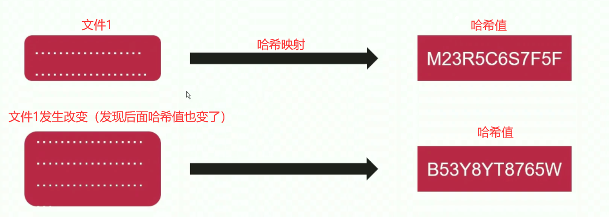

# 6、场景实践-负载均衡

## 6-1 负载均衡基础原理

- nginx 将请求代理到多台服务器去执行，就称之为负载均衡
- 这里的多台服务器通常**承担一样的功能任务**

## 6-2 配置实现 nginx 对上游服务器负载均衡

定义 3 台**上游服务器**（基于端口的虚拟主机）：

`/etc/nginx/conf.d/app_server.conf`

```shell
server {
	listen 8020;
	location / {
		return 200 'Return Result For Server 8020\n';
	}
}
server {
	listen 8021;
	location / {
		return 200 'Return Result For Server 8021\n';
	}
}
server {
	listen 8022;
	location / {
		return 200 'Return Result For Server 8022\n'
	}
}
```

定义 nginx 服务器用于负载均衡：

`/opt/nginx/conf.d/load_balance.conf`

```shell
upstream demo_server {
	# 三个 server 都没有加任何参数的情况下
	server 192.168.1.20:8020;
	server 192.168.1.20:8021;
	server 192.168.1.20:8022;
}

server {
	listen 80;
	server_name: balance.kutian.edu;
	
	location /balance/ {
		proxy_pass http://demo_server;
	}
}
```

```shell
# 定义好服务器以后，接下来就能进行一些列操作了
/opt/nginx/sbin/nginx -s reload
ss -nlt # 查看端口是不是监听着
vim /etc/hosts # 配置本地域名和 ip 的映射

# 对域名进行请求：
curl balance.kutian.edu/balance	# Return Result For Server 8020
curl balance.kutian.edu/balance	# Return Result For Server 8021
curl balance.kutian.edu/balance	# Return Result For Server 8022
curl balance.kutian.edu/balance	# Return Result For Server 8020
curl balance.kutian.edu/balance	# Return Result For Server 8020

# 可见不加任何参数的情况下，nginx 大致来说是按照定义的顺序来分配请求给上游服务器的（这是采用轮询的方式）
```

接下来试一试，在 upstream 中定义 server 时加上权重

`/opt/nginx/conf.d/load_balance.conf`

```shell
upstream demo_server {
	server 192.168.1.20:8020 weight=2;
	server 192.168.1.20:8021 weight=1;
}

server {
	listen 80;
	server_name: balance.kutian.edu;
	
	location /balance/ {
		proxy_pass http://demo_server;
	}
}
```

```shell
# 对域名进行请求：
curl balance.kutian.edu/balance	# Return Result For Server 8020
curl balance.kutian.edu/balance	# Return Result For Server 8020
curl balance.kutian.edu/balance	# Return Result For Server 8021
curl balance.kutian.edu/balance	# Return Result For Server 8020
curl balance.kutian.edu/balance	# Return Result For Server 8021

# 可见加了权重的情况下，也并不是访问了权重为 2 的，后面访问的一定是权重为 1 的；分配权重指的是，在量比较大的情况下，权重高的总体来说会先被分配。
```

## 6-3 负载均衡算法 — 哈希算法

### 哈希算法概念

- 哈希算法是将任意长度的二进制值映射为较短的**固定长度的二进制值**，这个小的二进制值我们称之为哈希值。
- 散落明文到哈希值的映射是不可逆的



如果文件的内容不变，哈希值是不会变的。这样的用处就是，数据发送给服务器的时候在网络中是分组转发的，如果到了服务器拼接了之后文件内容发生了改变（比如丢包），那么哈希值就会发生变化；可以通过比较哈希值来判断文件是否发生了改变。

### hash 指令

- 语法：hash key [ consistent ]：key 的意思是根据哪个 key（比如挑选某个请求头信息，或者 ip） 来进行 hash 运算；
- 默认值：无
- upstream

### 演示一波

定义**上游服务器**：

`/etc/nginx/conf.d/app_server.conf`

```shell
server {
	listen 10020;
	location / {
		return 200 'Return Result For Server 10020\n';
	}
}
server {
	listen 10010;
	location / {
		return 200 'Return Result For Server 10010\n';
	}
}
```

配置 nginx 来进行反向代理

`/opt/nginx/conf.d/load_balance.conf`

```shell
upstream demo_server_1 {
	hash $request_uri; # 使用了 hash 算法之后，如果你的 uri 不发生变化，那么就会永远给你分配那一台后端应用程序服务器，不会发生变化。
	server 192.168.1.20:10020;
	server 192.168.1.20:10010;
}
server {
	listen 80;
	server_name balance_hash.kutian.edu;
	
	location / {
		proxy_pass http://demo_server_1;
	}
}
```

```shell
# 测试一波
curl balance_hash.kutian.edu/index.html # Return Result For Server 10020
curl balance_hash.kutian.edu/index.html # Return Result For Server 10020
curl balance_hash.kutian.edu/index.html # Return Result For Server 10020
# 由此发现 uri 没发生变化，那么分配的应用程序服务器也不变

curl balance_hash.kutian.edu/test/index.html # Return Result For Server 10010
curl balance_hash.kutian.edu/test/index.html # Return Result For Server 10010
curl balance_hash.kutian.edu/test/index.html # Return Result For Server 10010
# uri 发生改变，分配的应用程序发生了变化

```

hash 算法在这里的应用主要是缓存的方面比较多。

## 6-4 负载均衡算法 — ip_hash 算法


## 6-5 负载均衡算法 — 最少连接数算法


## 6-6 负载均衡场景下 nginx 针对上游服务器返回异常时的容错机制

