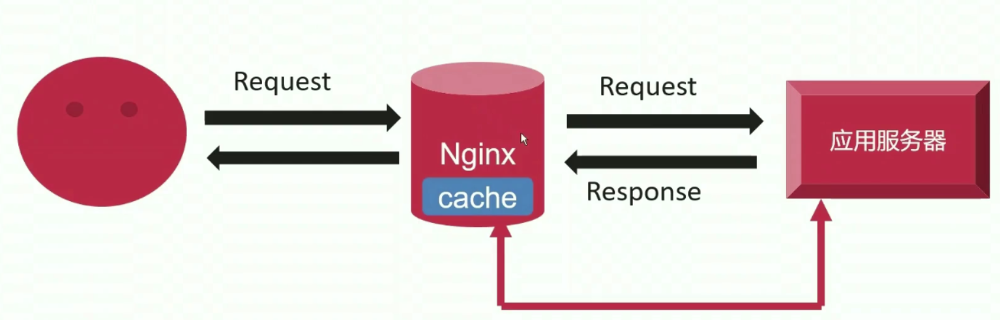

# 7、场景实践-缓存及HTTPS

## 7-1 缓存基础

### 缓存流程

当用户发送请求的时候，请求到达 nginx，nginx 处理的速度非常快，它可以直接处理返回静态请求，然后把动态请求调度给后端应用程序服务器。后端应用程序服务器处理完请求之后把响应传回给 nginx，这个响应的速度是比较慢的，因为服务器可能需要进行数据库操作，然后进行比较复杂的计算，因此这个地方就成了可以优化的地方。nginx 拿到了后端服务器的响应之后，再把响应返回给用户。

缓存就是在 nginx 内开辟一段空间，用户第一次请求的时候是正常走上面的流程，但是第二次请求的时候，nginx 会判断这个请求是不是和之前的请求一样，如果一样的话那么将不会再将请求调度给后端服务器，而是直接返回缓存的内容，这样就节省了时间，提高了用户体验（**现代的企业中，缓存比做！**）。



### 缓存的分类

- 客户端缓存
  - 优点：直接在本地获取内容，没有网络消耗，响应最快
  - 缺点：仅对单一用户生效
- 服务端缓存
  - 优点：对所有用户生效；有效降低上游应用服务器压力
  - 缺点：用户仍然有网络消耗

- 最佳实践：同时启用客户端缓存和服务端缓存

## 7-2 缓存相关指令用法

### 指令

- **proxy_cache**：指定缓存是否开启，若是选择了 zone，那就说明会在内存中开辟一段内存空间来进行缓存。
  - 语法：proxy_cache zone | off;
  - 默认值：proxy_cache off;
  - 上下文：http、server、location;

- **proxy_cache_path**：指定缓存的路径（它是和 proxy_cache 配合起来使用的）。

  - 语法：proxy_cache_path **path** [ level=levels ] [ use_temp_path=on|off ] **keys_zone=name:size** [ inactive=time ] [ max_size=size ] [manager_files=number ] [ manager_sleep=time ] [manager_threshold=time ] [ loader_files=number ] [ loader_sleep=time ] [ loader_threshold=time ] [ purger=on|off ] [ purger_files=number ] [ purger_sleep=time ] [ purger_threshold=time ]

    path 是必选，它的后面会直接跟着目录名称，指定缓存存放到磁盘的路径（虽然 nginx 最开始的时候会把缓存放到内存中，但是它也会定期地将缓存存到磁盘上，这样就避免了 nginx 重启的时候缓存会失效）。

    keys_zone 也是必选，指定共享内存名称，以及共享内存的大小

  - 默认值：proxy_cache_path off;

  - 上下文：http

  - **可选参数含义**

    | 可选参数          | 含义                                                         |
    | ----------------- | ------------------------------------------------------------ |
    | path              | 缓存文件的存放路径                                           |
    | level             | path 的目录层级                                              |
    | use_temp_path     | off 直接使用 path 路径；on 使用 proxy_temp_path 路径         |
    | keys_zone         | name 是共享内存名称；size 是共享内存大小                     |
    | inactive          | 在指定时间内没有被访问缓存会被清理；默认 10 分钟             |
    | max_size          | 设定最大的缓存文件大小，超过将由 CM 清理（**这是久违的 cache manager 子进程呀！**） |
    | manager_files     | CM 清理一次缓存文件，最大清理文件数；默认 100                |
    | manager_sleep     | CM 清理一次后进程的休眠时间；默认 200 毫秒；（**定义最大清理文件数和休眠时间，意图就是防止 CM 占用资源太多，导致 worker 子进程资源变少，如果 worker 子进程资源变少，那么它的处理并发的能力就会减弱**） |
    | manager_threshold | CM 清理一次最长耗时；默认是 50 毫秒                          |
    | loader_files      | CL 载入文件到共享内存，每批最多文件数；默认 100              |
    | loader_sleep      | CL 加载缓存文件到内存后，进程休眠时间；默认 200 毫秒         |
    | loader_threshold  | CL 每次载入文件到共享内存的最大耗时；默认 50 毫秒            |

- **proxy_cache_key**：缓存的内容的 key。nginx 在对资源做缓存的时候，它需要对资源的某一部分做 hash 计算，而对于哪一部分做 hash 计算，就由 proxy_cache_key 来指定。也就是说这个 key 是由我们自己指定的。
  - 语法：proxy_cache_key string;
  - 默认值：proxy_cache_key $scheme$proxy_host$reqeust_uri;
  - 上下文：http、server、location

- **proxy_cache_valid**：用来指定对哪些内容进行响应
  - 语法：proxy_cache_valid [ code... ] time;   这个 code 就是 http 的状态码
  - 默认值：-
  - 上下文：http、server、location
  - 配置示例：proxy_cache_valid 60m； 在不写任何状态码的时候，只对200、301、302 响应码缓存

### upstream_cache_status 变量

- 变量名：upstream_cache_status
- 变量的值：
  - MISS：未命中缓存
  - HIT：命中缓存
  - EXPIRED：缓存过期
  - STALE：命中了陈旧缓存
  - REVALIDDATED：nginx 验证陈旧缓存依然有效
  - UPDATING：内容陈旧，但正在更新
  - BYPASS：响应从原始服务器获取

## 7-3 缓存用法配置示例

nginx 缓存配置：

`opt/nginx/conf.d/nginx_cache.conf`

```shell
# http { # 这个配置文件在 http 里面被 include 了
	proxy_cache_path /opt/nginx/cache_temp levels=2:2 keys_zone=cache_zone:30m max_szie=32g inactive=60m use_temp_path=off;
	
	upstream cache_server {
	    server 192.168.1.20:1010;
        server 192.168.1.20:1011;
	}
	
	server {
		listen 80;
		server_name cache.kutian.edu;
		
		location / {
			proxy_cache cache_zone; # 与上面 keys_zone 保持一致
			proxy_cache_valid 200 5m;
			proxy_cache_key $proxy_host$request_uri;
			add_header Nginx-Cache-Status "$upstream_cache_status";
			proxy_pass http://cache_server;
		}
	}

# }
```


## 7-4 配置 nginx 不缓存上游服务器特定内容

在某些变更比较频繁的情境下（比如购物网站），可能希望 nginx 不缓存上游服务器的特定内容。

### 指令

- **proxy_no_cache**：指定不缓存上游服务器的特定内容
  - 语法：proxy_no_cache string;
  - 默认值：-
  - 上下文：http、server、location

### 配置

`/opt/nginx/conf.d/nginx_cache.conf`

```shell
# http { # 这个配置文件在 http 里面被 include 了
	proxy_cache_path /opt/nginx/cache_temp levels=2:2 keys_zone=cache_zone:30m max_szie=32g inactive=60m use_temp_path=off;
	
	upstream cache_server {
	    server 192.168.1.20:1010;
        server 192.168.1.20:1011;
	}
	
	server {
		listen 80;
		server_name cache.kutian.edu;
		
		if ( $request_uri ~ \.(txt|text)$ ) { # 对 .txt 和 .text 结尾的文件做特殊处理
			set $cookie_name "no cache"; # 声明一个变量，将 no cache 赋值给 cookie_name
		}
		
		location / {
			proxy_cache cache_zone; # 与上面 keys_zone 保持一致
			proxy_no_cache $cookie_name;
			proxy_cache_valid 200 5m;
			proxy_cache_key $proxy_host$request_uri;
			add_header Nginx-Cache-Status "$upstream_cache_status";
			proxy_pass http://cache_server;
		}
	}

# }
```


## 7-5 缓存失效降低上游压力机制—合并源请求

当用户发送很多并发请求到 nginx 的时候，由于一些原因缓存失效（比如重启），nginx 必须把所有的请求透传给后端的应用程序服务器，这很可能让服务器瘫痪掉。为了避免这一情况的发生，nginx 会采取一些措施来降低上游压力机制。

### 指令

- **proxy_cache_lock：**当很多请求到达 nginx 的时候，如果是 on，那么 nginx 只会让一条请求透传到后端服务器，一条解决了并响应给 nginx 的时候，才会发下一条请求给 nginx 服务器。
  - 语法：proxy_cache_lock on | off;
  - 默认值：proxy_cache_lock off;
  - 上下文：http、server、location

- **proxy_cache_lock_timeout：**当 nginx 把第一个请求发送给服务器之后，由于出现一些故障并没有返回内容，那么设置一个超时时间，若过了这个超时时间，nginx 就会把剩余的所有请求都透传给后端应用程序服务器。
  - 语法：proxy_cache_lock_timeout time;
  - 默认值：proxy_cache_lock_timeout 5s;
  - 上下文：http、server、location

- **proxy_cache_lock_age：**当 nginx 把第一个请求发送给服务器之后，由于出现一些故障并没有返回内容，它会过一段时间再发送第二个请求，如果第二个请求也没有响应，那么再过一段时间发送第三个请求...... 也就是说它是一个请求一个请求发的。
  - 语法：proxy_cache_lock_age time;
  - 默认值：proxy_cache_lock_age 5s;
  - 上下文：http、server、location

### 配置

`/opt/nginx/conf.d/nginx_cache.conf`

```shell
# http { # 这个配置文件在 http 里面被 include 了
	proxy_cache_path /opt/nginx/cache_temp levels=2:2 keys_zone=cache_zone:30m max_szie=32g inactive=60m use_temp_path=off;
	
	upstream cache_server {
	    server 192.168.1.20:1010;
        server 192.168.1.20:1011;
	}
	
	server {
		listen 80;
		server_name cache.kutian.edu;
		
		if ( $request_uri ~ \.(txt|text)$ ) { # 对 .txt 和 .text 结尾的文件做特殊处理
			set $cookie_name "no cache"; # 声明一个变量，将 no cache 赋值给 cookie_name
		}
		
		location / {
			proxy_cache cache_zone; # 与上面 keys_zone 保持一致
			proxy_no_cache $cookie_name;
			proxy_cache_valid 200 5m;
			proxy_cache_key $proxy_host$request_uri;
			add_header Nginx-Cache-Status "$upstream_cache_status";
			proxy_pass http://cache_server;
			# 缓存失效以后的策略
			proxy_cache_lock on;
			proxy_cache_lock_timeout 5s;
			proxy_cache_lock_age 5s;
		}
	}

# }
```


## 7-6 缓存失效降低上游压力机制—启用陈旧缓存

对于某些实时性要求没那么高的场景来说，返回一个陈旧的内容比直接返回 404 的用户体验是更好的。当有很大的并发请求到达 nginx 服务器，nginx 出于某些原因缓存失效，这时候按理来说会把所有请求都透传给上游服务器，但是开启了陈旧缓存之后，有些请求会直接调用陈旧缓存来返回，这样就大大减少了上游服务器的压力。

### 指令

- **proxy_cache_use_stale：** 启用陈旧缓存

  - 语法：proxy_cache_use_stale error | timeout | invalid_header | updating | http_500 | http_502 | http_503 | http_504 | http_403 | http_404 | http_429 | off ... ;

  - 默认值 ：proxy_cache_use_stale off;

  - 上下文：http、server、location

  - 可选参数含义

    | 可选参数       | 含义                                       |
    | -------------- | ------------------------------------------ |
    | error          | 与上游建立连接、发送请求、读取响应头出错时 |
    | timeout        | 与上游建立连接、发送请求、读取响应头超时时 |
    | invalid_header | 无效头部时                                 |
    | updating       | 缓存过期，正在更新时                       |
    | http_500       | 返回状态码 500 时                          |
    | http_502       | 返回状态码 502 时                          |
    | http_503       | 返回状态码 503 时                          |
    | http_504       | 返回状态码 504 时                          |
    | http_403       | 返回状态码 403 时                          |
    | http_404       | 返回状态码 404 时                          |
    | http_429       | 返回状态码 429 时                          |

- **proxy_cache_background_update：**让新的缓存更新的时候，在后台去执行。

  如果是 off 的情景下，第一个请求过来，nginx 发现缓存失效，那么第一个请求就会被 nginx 交给上游服务器。这个时候对于第一个请求来说它是得不到结果的，它可能需要很长的时间等待上游服务器响应。

  如果是 on 的情境下，对于 nginx 来说，不管你是第一个请求还是第几个请求，都会直接使用 nginx 自身的缓存然后直接返回。但是 nginx **自身**会发起 http 请求给上游应用服务器，让上游服务器去更新对应的资源。也就是说不是由客户端请求去更新的，是 nginx 自身会发起 http 请求给上游应用服务器然后去更新。这个时候对用户的体验是比较好的，因为即使是第一个请求也马上返回了虽然用的是过期的缓存。

  所以这个指令就是针对第一个请求是有效的，它会让所有的 nginx 请求都使用陈旧缓存，直接返回结果。

  - 语法：proxy_cache_background_update on | off;
  - 默认值：proxy_cache_background_update off;
  - 上下文：http、server、location;

### 配置

`/opt/nginx/conf.d/nginx_cache.conf`

```shell
# http { # 这个配置文件在 http 里面被 include 了
	proxy_cache_path /opt/nginx/cache_temp levels=2:2 keys_zone=cache_zone:30m max_szie=32g inactive=60m use_temp_path=off;
	
	upstream cache_server {
	    server 192.168.1.20:1010;
        server 192.168.1.20:1011;
	}
	
	server {
		listen 80;
		server_name cache.kutian.edu;
		
		if ( $request_uri ~ \.(txt|text)$ ) { # 对 .txt 和 .text 结尾的文件做特殊处理
			set $cookie_name "no cache"; # 声明一个变量，将 no cache 赋值给 cookie_name
		}
		
		location / {
			proxy_cache cache_zone; # 与上面 keys_zone 保持一致
			proxy_no_cache $cookie_name;
			proxy_cache_valid 200 5m;
			proxy_cache_key $proxy_host$request_uri;
			add_header Nginx-Cache-Status "$upstream_cache_status";
			proxy_pass http://cache_server;
			# 缓存失效以后的策略
			proxy_cache_lock on;
			proxy_cache_lock_timeout 5s;
			proxy_cache_lock_age 5s;
			# 启用陈旧缓存
			proxy_cache_use_stale error timeout updating;
			proxy_cache_background_update on;
		}
	}

# }
```


## 7-7 第三方缓存清除模块 nginx_cache_purge 介绍

### 模块功能

- 功能：根据接收的 HTTP 请求立即清除缓存
- 使用 --add-module 指令添加到 nginx 中

### 指令

- **proxy_cache_purge**
  - 语法：proxy_cache_purge zone_name key;  zone_name 是共享内存的地址，在清除某些缓存的时候可以带上 key（可以看看上面的 proxy_cache_key 指令）。
  - 默认值：无
  - 上下文：http、server、location

## 7-8 ngx_cache_purge 用法配置示例

nginx 配置：

`/opt/nginx/conf.d/nginx_cache.conf`

```shell
# http { # 这个配置文件在 http 里面被 include 了
	proxy_cache_path /opt/nginx/cache_temp levels=2:2 keys_zone=cache_zone:30m max_szie=32g inactive=60m use_temp_path=off;
	
	upstream cache_server {
	    server 192.168.1.20:1010;
        server 192.168.1.20:1011;
	}
	
	server {
		listen 80;
		server_name cache.kutian.edu;
		
		if ( $request_uri ~ \.(txt|text)$ ) { # 对 .txt 和 .text 结尾的文件做特殊处理
			set $cookie_name "no cache"; # 声明一个变量，将 no cache 赋值给 cookie_name
		}
		
		# 定义这个 location 专门用来清除缓存
		location ~ /cache_purge(/.*) { # 用括号括起来之后就可以直接用 $1 来引用这个变量
			proxy_cache_purge cache_zone $host$1;# 缓存的空间是 cache_zone；缓存资源的 key 是 $host$uri
		}
		
		location / {
			proxy_cache cache_zone; # 与上面 keys_zone 保持一致
			proxy_no_cache $cookie_name;
			proxy_cache_valid 200 5m;
			proxy_cache_key $host$uri;
			add_header Nginx-Cache-Status "$upstream_cache_status";
			proxy_pass http://cache_server;
			# 缓存失效以后的策略
			proxy_cache_lock on;
			proxy_cache_lock_timeout 5s;
			proxy_cache_lock_age 5s;
			# 启用陈旧缓存
			proxy_cache_use_stale error timeout updating;
			proxy_cache_background_update on;
		}
	}

# }
```


## 7-9 关于 https

### http 协议存在的问题

- 数据使用明文传输，可能被黑客窃取（**https 使用加密技术进行了信息加密**）
- 报文的完整性无法验证，可能被黑客篡改（**https 用数字签名来保证报文完整性**）
- 无法验证通信双方的身份，可能被黑客伪装（**https 用数字证书验证身份**）

### https

- 所谓 https，其实只是身披 **TLS/SSL** 协议外壳的 http
- https 并非一个应用层协议

## 7-10 https 如何解决信息被窃听的问题

### 加密算法

- 对称加密：DES、AES、3DES
- 非对称加密：RSA、DSA、ECC

### 对称加密优劣势

- 优势
  - 解密效率高
- 劣势
  - 密钥无法实现安全传输
  - 密钥的数目难于管理（第一个客户端与服务器建立连接的时候维护一个密钥；第二个客户端与服务器连接的时候也维护一个密钥.....客户端一多，服务器要维护的密钥也就越来越多了，这对高并发的服务器来说是个灾难。）
  - 无法提供信息完整性校验

### 非对称加密算法优劣势

- 优势
  - 服务器仅维持一个私钥即可
- 劣势
  - 公钥是公开的
  - 非对称加密算法加解密过程中会耗费一定时间
  - 公钥并不包含服务器信息，存在中间人攻击的可能性。

### https 加密的原理

- https 混合使用对称加密和非对称加密
- 连接建立阶段使用非对称加密算法
- 内容传输阶段使用对称加密算法

## 7-11 https 如何解决报文被篡改以及身份伪装问题

### 解决报文被篡改—数字签名

- 确定消息的确是由发送方签名发送过来的，因为别人假冒不了发送方的签名
- 能确定消息的完整性，证明数据从未被其他人篡改过

### 数字签名生成流程


### 数字签名验证流程


### 解决身份伪装的问题

这个问题利用 CA 就能够很好地解决。

## 7-12 配置私有 CA 服务器

真正的 CA 服务器在实际生产环境中是不怎么用的，因为在公网中的 htttps 通常是会去买真正的证书。在这里配置是为了熟悉颁发证书的一个流程。

## 7-13 组织机构向 CS 申请书及 CA 签发证书


