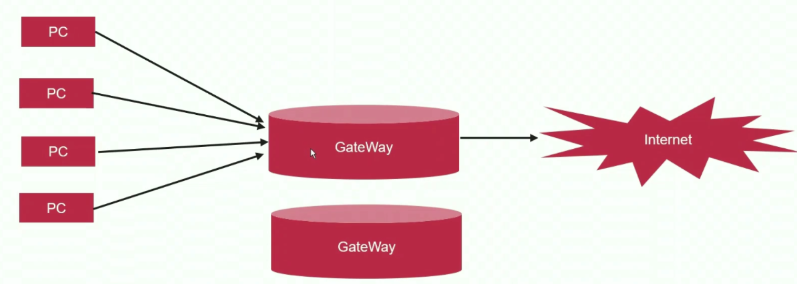
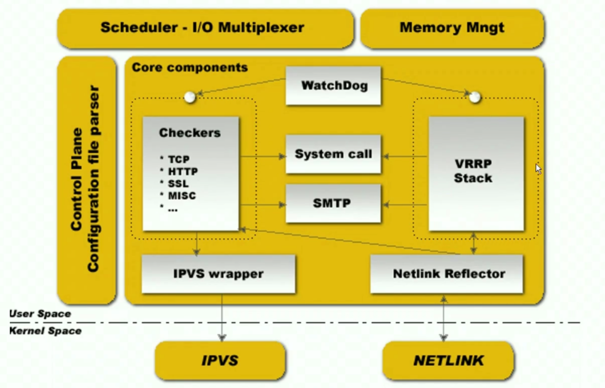

# 8、Nginx架构

## 8-1 nginx 高可用基础

### 服务可用三要素

假定有一个传统的客户端—服务器模式。在互联网中有一个用户，然后自己也部署了一个 server，那么要想实现一个服务可用，有哪些要素是必备的？

首先，**肯定需要一个 IP 地址**。如果在公网中部署服务器，那么就需要有自己的公网 IP 地址（如果是在内网中部署的服务器，那就不需要公网 IP 了）。你还可以申请一个域名。

其次，如果你是个服务器，**那么肯定就需要安装对应的服务器软件**（nginx 就安装 nginx 软件，mysql 就安装 mysql 软件），安装完了以后还需要把这个软件启动起来，从而去监听某一个端口。

最后，**你还需要有数据文件**。假如是一个 nginx 提供的 web server 服务器，那就必须要有对应的服务器的资源文件。假如这个 nginx 就是提供一个静态资源的 web server，那就必须要有对应到磁盘上的许多静态文件（html，css，js 等）。假如是 mysql 服务器，那可能需要 mysql 对应的数据文件。

综上，服务可用的三要素就是：

- **IP 地址**
- **监听端口（软件程序启动）**
- **数据文件**

因此，对某项服务进行高可用的时候，我们只需要保证上面的这三个要素是高可用的，这样就实现了服务的高可用。

### nginx 高可用

假设一台 nginx 服务器在运行过程中遇到了高并发的请求，或者是服务器掉电等不可控制的故障的发生，我想要去实现业务连续性的**高可用**，那么该如何保证在宕机情况下服务可用的三要素可以转移到另外的一台备用的 nginx 服务器上呢（也就是说 IP 地址和域名配置到这台备用的 nginx 服务器上；备用服务器开启了和原服务器一样的端口，比如 80、443；备用服务器上也有一模一样的数据资源文件）？解决了上面的问题，也就解决了高可用的问题。

**数据文件高可用**比较简单，当你写完前端代码之后保存在原服务器的磁盘的目录，那么把这个文件拷贝到备用服务器的相同的目录下即可。也就是说保证了这个数据文件是有两份的。

**对于监听端口的高可用**，只需要在备用 nginx 服务器上进行相同的配置即可。

这样，唯一的难点就是如何去保证 nginx 上配置的 IP 地址能够在其宕机的时候自动转移到备用的 nginx 服务器上。而 VRRP 协议就解决了这个问题，它能将 IP 地址从一台服务器转移到另一台服务器上，同时在两台服务器之间有心跳信息监控，也就是说主 nginx 可用的时候，IP 会一直配置在主 nginx 服务器上，如果主 nginx 宕机，那么 IP 地址就会转移到备用的 nginx 服务器上。 

## 8-2 虚拟路由冗余协议 VRRP 原理

### VRRP 原理

在公司的内网内，许多员工都有自己的 PC，这些 PC 想要通过网关设备（GateWay）去访问互联网，不可能为每台 PC 都分配一个公网 IP 地址因为公网 IP 有成本。这时候的解决方案就是，在 GateWay 上配置两个 IP 地址，其中一个是内网 IP 地址，内网 IP 地址和所有的 PC 是在同一个网段的；然后在 GateWay 的另外的网卡上配置一个公网的 IP 地址，这样GateWay 就能实现公网 IP 和内网 IP 都是相通的。

这个时候 PC 想要访问公网 Internet 的一些东西（比如浏览网页，查找一些文件）的时候，它会将请求转发到 GateWay，到了 GateWay 之后，GateWay 会用自己另外配置了公网 IP 的网卡把请求转发给 Internet。



这时候会有一个问题，对于 GateWay 这样的网关设备（它可能是路由器或者是别的什么东西），它是一个单点，也就是说假设网关设备出现了问题之后，内网中所有的 PC 其实都是无法访问公网中的 Internet 了。如果要解决单点故障的问题，会有这样一个思路：准备另一台 GateWay 网关设备（也就是说有两台一模一样的设备），给这台 GateWay 也配置上两个 IP 地址（一个内网的 IP 地址，一个公网的 IP 地址）。

这个时候又会出现一个问题，那就是内网中这两个 GateWay 的 IP 不能是相同的。那么该如何实现两个 GateWay 对所有的 PC 都只呈现一个 IP 地址呢？VRRP 就能实现这个功能。


假设 Master GateWay 上配置的内网 IP 是 192.168.1.2，Backup GateWay 上配置的内网 IP 是 192.168.1.3，这两个 IP 地址不是用来给 PC 们访问用的。这时候会再有一个公用的 IP 地址：192.168.1.1（就是上面所示的 VIP，就是虚拟的IP），这个 IP 地址在两个 GateWay 上都能够配置，因为它是在两个 GateWay 之间漂移的。这个 VIP 是真正对 PC 提供服务的（也就是说 PC 的代理都要设置成这个 VIP 地址）。如果是 Master GateWay 在进行工作，那么 VIP 就是配置在 Master 上的，不会配置在 Backup GateWay 上。如果 Master GateWay 出现故障了，这个时候 VIP 才会漂移到 Backup GateWay 上。

那问题又来了，为啥还要有 VMAC 这个地址呢？我们都知道 MAC 地址是和我们的网卡绑定的，不同网卡的 MAC 地址是不一样的。如果 VIP 是配置在 Master GateWay 上的，这个时候对应的 PC 电脑和 VIP 进行通信的时候它会发 ARP 请求，同时它得到的会是 Master GateWay 上的对应网卡的 MAC 地址信息。这个时候如果 VIP 转移到备用机器上了，备用机器的 MAC 地址肯定和之前的不一样。所以这个时候需要有一个 VMAC，它这个 MAC 对于所有的客户端来说都是一样的。所以当 GateWay 正常工作时，VIP 和 VMAC 会一同配置到它上面；如果 GateWay 出现故障了，那么 VIP 和 VMAC 会一同被转移到备用机上，**其实这就是 VRRP 实现的能力**。

### 核心概念

- 虚拟网关：有一个 Master 和 多个 Backup 组成
- Master 网关：实际承载报文转发的节点，主节点
- Backup 网关：主节点故障后转移节点，备用节点
- 虚拟 IP 地址：虚拟网关对外提供服务的 IP 地址
- IP 地址拥有者：真实提供服务的节点，通常为主节点
- 虚拟 MAC 地址：回应 ARP 请求时使用的虚拟 MAC 地址
- 优先级：如果有多台 Backup 网关，当主节点挂掉了之后会优先使用高优先级的 Backup 来配置
- 非抢占式：若有两台 Backup（假定为 Backup1 和 Backup2，且 Backup1 的优先级高于 Backup2），Backup1 出问题了，配置会转移到 Backup2；若 Backup1 好了，那么配置会继续在 Backup2 生效，不会转移回 Backup1。
- 抢占式：与非抢占式相反，若 Backup1 好了，它的优先级比较高，会去枪 Backup2 的配置，所以配置会转移回 Backup2
- **注意**：抢占式和非抢占式对 Master 无效，也就是说 Master 一旦恢复了，它一定会去抢配置

## 8-3 KeepAlived 软件架构

KeepAlived 是实现了 VRRP 的软件。

### KeepAlived 架构图



### 核心能力

- 服务器服务的故障转移
- 通常用于对负载均衡器做高可用

### 设用场景

- 高可用 LVS
  - 虚拟 IP 的转移
  - 生成 ipvs 规则
  - RS（real server） 健康状态检测
- 高可用其他服务
  - 虚拟 IP 的转移
  - 编写脚本实现服务启动 / 停止

### KeepAlived 核心组件

- vrrp stark：vrrp 协议的实现
- ipvs wrapper：为集群内的节点生成 ipvs 规则
- checkers：对集群内所有的 RS 做健康状态检测
- 控制组件：设置文件解析和加载

## 8-4 使用 KeepAlived 配置实现虚拟 IP 在多服务器节点漂移

### 实验规划

- 2 台 Linux，一主一备。
- 节点1   192.168.1.30   CentOS   Master
- 节点2   192.168.1.40   CentOS   Backup
- VIP      192.168.1.50 

### 实验步骤

**Master：192.168.1.30**

```shell
# 安装 KeepAlived
yum install keepalived

# 看看生成了哪些文件
rpm -ql keepalived

# 看看主配置文件，并修改一波
vim /etc/keepalived/keepalived.conf
```

`/etc/keepalived/keepalived.conf`

```shell
# 指定了 keepalived 的全局属性，里面所有的定义对整个 keepalived 都会生效
global_defs {
	notification_email { # 用于通知的 email。
		kong@qq.com
	}
	notification_email_from ka@qq.com # 发邮件者
	smtp_server 192.168.1.200 # 我们这里不存在真正的邮件服务器，所以随便写一个
	smtp_connect_timeout 30 # 连接邮件服务器时候的超时时长
	router_id Nginx # 这个名字不用管
	# 下面这些配置可以先注释掉
	# vrrp_skip_check_adv_addr
	# vrrp_strict # 严格模式，生产环境可以去掉
	# vrrp_garp_interval 0
	# vrrp_gna_interval 0
}

# vrrp 的实例，这个实例的名称叫做 VI_1
vrrp_instance_VI_1 {
	state MASTER # 在当前的 vrrp 实例中是 Master 节点还是 Backup 节点。
	interface eth33 # 当前的服务器需要去绑定的网卡，网卡的名字是 eth33
	virtual_router_id 51 # 标注虚拟路由的 id
	priority 100 # 指定优先级，当故障发生的时候值越大的会优先顶替上去
	advert_int 1
	# nopreempt # 如果是 Backup，默认是抢占式的，有了这句话就能变成非抢占式的。这对 Master 无效。
	authentication {
		auth_type PASS
		auth_pass 1111
	}
	virtual_ipaddress { # 在这里面配置虚拟的 IP 地址，也就是真正提供服务的 IP 地址
		192.168.1.50
	}
}

# 下面一些没有的都可以删掉了
# ...
```

```shell
# 关闭一下 selinux 和 防火墙，不关闭的话，心跳信息可能传递不过去
setenforce 0
systemctl stop firewalld

# 启动
systemctl start keepalived
```

**Backup：192.168.1.40**

```shell
# 安装 KeepAlived
yum install keepalived

# 看看主配置文件，并修改一波
vim /etc/keepalived/keepalived.conf
```

`/etc/keepalived/keepalived.conf`

```shell
global_defs {
	notification_email {
		kong@qq.com
	}
	notification_email_from ka@qq.com
	smtp_server 192.168.1.200
	smtp_connect_timeout 30
	router_id Nginx 
}

# 这个实例名要和 Master 里面的一样
vrrp_instance_VI_1 {
	state BACKUP # 这个是备用服务器，所以是 BACKUP
	interface eth33 
	virtual_router_id 51 # 这个 router_id 必须和 Master 里面的一样！这样它才会理解这是相同的 vrrp_instance
	priority 98 # 优先级得比 Master 的低
	advert_int 1
	# nopreempt # 默认是抢占式的，有了这句话就能变成非抢占式的
	authentication {
		auth_type PASS
		auth_pass 1111
	}
	virtual_ipaddress {
		192.168.1.50
	}
}
```

```shell
# 关闭一下 selinux 和 防火墙
setenforce 0
systemctl stop firewalld

# 启动
systemctl start keepalived
```


## 8-5 KeepAlived + Nginx 高可用原理

光有虚拟端口的漂移可能还不够，根据服务可用的三要素，你的备用服务器还需要有相应的数据文件，还要启动 nginx 软件然后监听对应的端口。并且 keepalived 只会在自身服务关闭，或者服务器宕机的时候将虚拟 IP 进行转移，nginx 程序宕掉了，它是不会转移 IP 的。因此我们需要编写一个脚本来判断当前 nginx 是否存活。

`nginx_health.sh`

```shell
#!/bin/bash

# 查看 nginx 是否还存在
ps -ef | grep nginx | grep -v grep &> /dev/null

# 如果 $? 是 0，则说明 nginx 还存在
if [ $? -ne 0 ]; then
	killall keepalived # 杀死了 keepalived 就强制了虚拟 IP 进行转移
fi

```

```shell
# 给脚本赋予可执行权限
chmod +x nginx_health.sh

# 然后把这个脚本复制到另外一个节点上
```

有了脚本之后就可以去 keepalived 主配置文件里面进行脚本的配置

`/etc/keepalived/keepalived.conf`

```shell
# ...

#脚本配置
vrrp_script chk_http_port {
　　script "/nginx_health.sh"　　　　             #检测脚本文件的位置
　　interval 2　　　　　　　　　　　　　　　　　　　　#（检测脚本执行的间隔）
　　weight 2　　　　　　　　　　　　　　　　　　　　　　#权重（即当脚本中的条件成立时权重进行修改）
}

# ...
```

