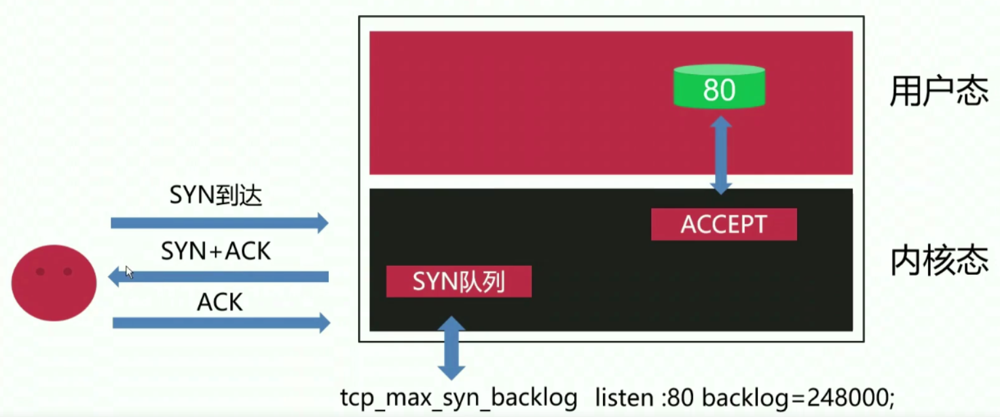

# 9、Nginx性能优化

## 9-1 提升 nginx 利用 cpu 的效率

### cpu 的调度机制

linux 操作系统是一个多任务的操作系统，它允许各个不同的用户在操作系统里执行很多个进程。假设系统只有一个 cpu，而要去运行多个进程的时候，那么毫无疑问 cpu 不可能同时去执行这些程序。也就是说 cpu 在同一时间只能调度一个任务去执行。

cpu 会给进程分配时间片，如果一个进程的优先级比较高，那么它得到的时间片就会多一点。如果进程在 cpu 中执行完了时间片分配的时间，那它会被强行从 cpu 上拿下来。如果一个进程它要被 cpu 执行的时候，它自己令自己陷入了阻塞状态（如从磁盘读取数据，因为 cpu 执行速度超快，比磁盘读取的速度快多了），那么即使它的时间片还没有走完， cpu 也会把这个进程先拿下来，然后去执行另外一个进程。cpu 就是这样循环往复地去执行这些进程任务。

### 优化 nginx 使用 cpu 遵循原则

- 尽可能占用全部的 cpu 资源
- 尽可能占用更大的 cpu 时间片、减少进程间切换

### 优化策略一

- 指定 worker 子进程：worker_processes auto;   这样有多少个 cpu 就会开启多少个子进程，这也是为了尽可能地利用 cpu 资源。

### 优化策略二

- 将 worker 子进程与每个 cpu 绑定：worker_cpu_affinity 01 10 01 10;   cpu 是有缓存的，绑定了 cpu 之后，worker 子进程下次再被 cpu 处理的时候就能够利用这些缓存，这样就能节省时间。而且这也减少了 worker 子进程在不同 cpu 之间进行切换，这也减少了开销。

### 优化策略三

- 提高 worker 子进程的进程优先级：worker_priority -20;

### 优先策略四

- 延迟处理新连接：listen 80 deferred;   

## 9-2 TCP 建立连接优化

### 相关的 TCP 内核参数

为了优化，下面这些参数可能要调小。

- net.ipv4.tcp_syn_retries = 6
- net.ipv4.tcp_synack_retries = 5
- net.ipv4.tcp_syncookies = 0

- 可以把 syn 队列的长度也调大

- net.core.netdev_max_backlog
- net.ipv4.tcp_max_syn_backlog
- net.core.somaxconn

## 9-3 启用 TCP 的 Fast Open 功能

### TCP Fast Open

- TCP Fast Oen（TFO）是用来加速连续 TCP 连接的数据交互的 TCP 协议扩展，由 Google 于 2011 年的论文提出。
- 为了改善web应用相应时延方面的一个工作，google通过修改TCP协议利用三次握手时进行数据交换的TFO。和TCP相比TFO在3次握手期间也会传输数据。TFO是GOOGLE发布的。目前chrome已经支持TFO，但默认是关闭的，因为它有一些特定的使用场景。