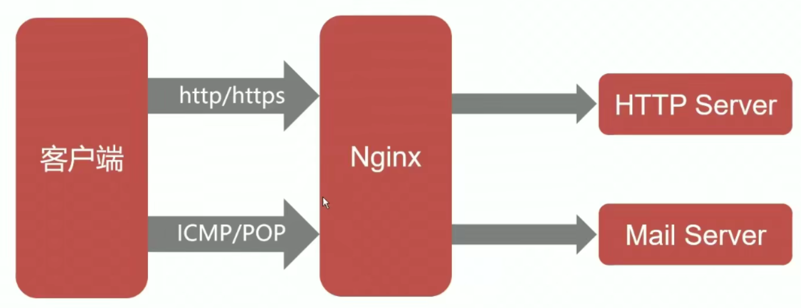
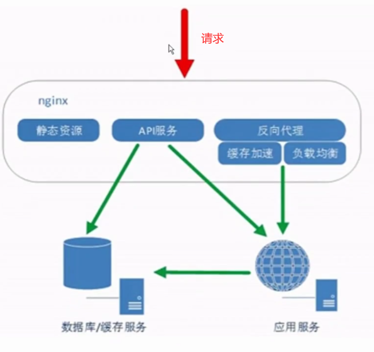

# 1、Nginx基础

## 1-1 概念

Nginx 是一个高性能的 HTTP 和反向代理 web 服务器。

## 1-2 高性能的 WEB 服务器（核心1）

- 高性能的静态 WEB 服务器（不能处理动态资源）

## 1-3 反向代理（核心2）

- 正向代理：隐藏了真实的请求客户端，服务端不知道真实的客户端是谁，客户端请求的服务都被代理服务器代替来请求。
- 反向代理：客户不知道真正提供服务人的是谁，反向代理隐藏了真实的服务端。

客户端发送 http 请求，nginx 接收到请求之后把静态资源返回给客户端，可以把动态的资源继续转发给应用程序服务器；应用程序服务器返回响应给 nginx，然后动态资源和静态资源就都返回给客户端了。

负载均衡就是通过反向代理实现。

## 1-4 Nginx 相较于 Apache 的优势

| Apache               | Nginx                |
| -------------------- | -------------------- |
| 一个进程处理一个请求 | 一个进程处理多个请求 |
| 阻塞式的             | 非阻塞式的           |

## 1-5 Nginx 的主要的应用场景

- 静态资源服务
  - 通过本地文件系统提供服务
- 反向代理服务
  - Nginx 的强大性能
  - 缓存 
  - 负载均衡
- API 服务
  - OpenResty

## 1-6 Nginx 的优势

- 高并发、高性能（一个进程处理多个请求）
- 扩展性好（自身使用模块化设计）
- 异步非阻塞的事件驱动模型
- 高可靠性
- BST 许可（允许二次开发）

## 1-7 安装第一个 rpm 的 Nginx

rpm 在生产环境可能用的比较少。

# 2、Nginx进程结构与热部署

# 3、核心指令-Nginx基础应用

# 4、HTTP核心模块-Nginx应用进阶

# 5、场景实践-反向代理【企业案例|焦点效应】

# 6、场景实践-负载均衡【企业案例|沃尔森法则】

# 7、场景实践-缓存及HTTPS【企业案例|黑洞效应】

# 8、深入Nginx架构，重塑思维

# 9、Nginx性能优化，提升B格

